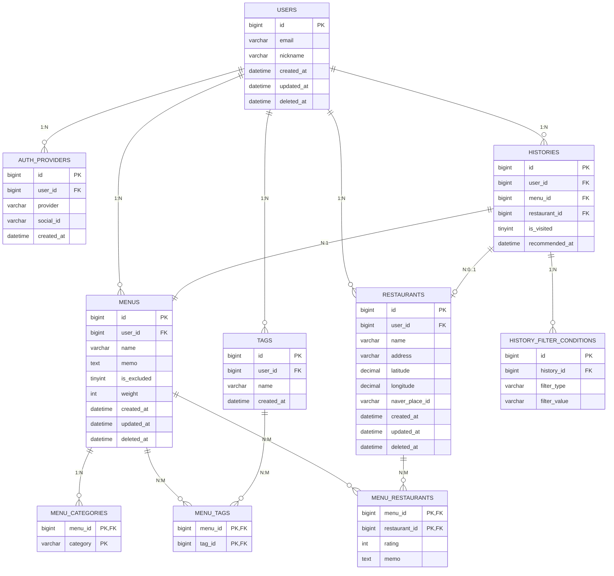

 
기획서(계속 수정)
---
| 구분 | 내용 |
| :--- | :--- |
| **기술 스택** | Java 17 / Spring Boot 3.x |
| **데이터베이스** | MySQL 8.x |
| **API 방식** | REST API (JSON) |
| **외부 API** | 네이버 지도 (백엔드 프록시) |

---

## 1. 기술 스택 및 아키텍처

### 1.1 전체 스택 구성

| 레이어 | 기술 | 버전 | 비고 |
| :--- | :--- | :--- | :--- |
| **Language** | Java | 17 LTS | Record, Sealed class 활용 |
| **Framework** | Spring Boot | 3.x | Spring Security 6, Web MVC |
| **ORM** | Spring Data JPA + Querydsl | 최신 | 복잡 필터 쿼리에 Querydsl 사용 |
| **Database** | MySQL | 8.x | 공간 인덱스(Spatial Index) 활성화 |
| **Migration** | Flyway | 최신 | DB 스키마 버전 관리 |
| **Auth** | Spring Security + JWT | - | Access/Refresh Token 이중 구조 |
| **Cache** | Redis | 7.x | Refresh Token 저장, 필터 캐싱 |
| **Build** | Gradle | 8.x | - |
| **Infra** | Docker + Docker Compose | - | 로컬/스테이징 환경 |
| **Logging** | SLF4J + Logback | - | MDC 트레이싱 포함 |

### 1.2 서비스 아키텍처 구조
* 레이어드 아키텍처 (Controller → Service → Repository) 를 기본으로 하며, 외부 연동(네이버 API) 은 별도 Client 레이어로 분리한다.

| 레이어 | 패키지 | 책임 |
| :--- | :--- | :--- |
| **Presentation** | `controller/` | HTTP 요청/응답 처리, 입력 검증 (Bean Validation) |
| **Application** | `service/` | 비즈니스 로직, 트랜잭션 관리 |
| **Domain** | `domain/` | Entity, Repository 인터페이스, 도메인 이벤트 |
| **Infrastructure** | `repository/`, `client/` | JPA 구현체, 네이버 API WebClient |
| **Common** | `config/`, `security/`, `exception/` | 공통 설정, 인증 필터, 전역 예외 처리 |

---

## 2. API 설계 기준

### 2.1 공통 규칙
* **Base URL:** `/api/v1`
* **Content-Type:** `application/json`
* **인증:** `Authorization: Bearer {accessToken}` 헤더
* **날짜/시간:** ISO 8601 형식 (예: 2026-05-07T12:00:00Z)
* **문자 인코딩:** UTF-8

### 2.2 공통 응답 포맷
모든 API 응답은 아래 구조를 따른다.
* **성공 응답 (2xx):** `{ "success": true, "data": { ... }, "message": null }`
* **실패 응답 (4xx / 5xx):** `{ "success": false, "data": null, "message": "에러 설명", "code": "ERROR_CODE" }`

### 2.3 페이지네이션
* 목록 조회 API는 커서 기반 페이지네이션을 기본으로 한다.
* **요청:** `GET /api/v1/menus?cursor=12345&size=20`
* **응답 data 내:** `items[]`, `nextCursor` (null이면 마지막 페이지), `hasNext`

### 2.4 HTTP 상태 코드 기준

| 코드 | 의미 | 사용 시점 |
| :--- | :--- | :--- |
| **200 OK** | 성공 | 조회, 수정, 삭제 성공 |
| **201 Created** | 생성 성공 | 메뉴/식당/태그 등 리소스 생성 |
| **400 Bad Request** | 입력 오류 | 필수값 누락, 형식 불일치 |
| **401 Unauthorized** | 인증 실패 | 토큰 없음 / 만료 |
| **403 Forbidden** | 권한 없음 | 다른 사용자 리소스 접근 |
| **404 Not Found** | 리소스 없음 | 존재하지 않는 ID |
| **409 Conflict** | 중복 충돌 | 이미 존재하는 태그명 등 |
| **500 Internal Server Error** | 서버 오류 | 예상치 못한 서버 오류 |

### 2.5 주요 API 목록

**인증 (Auth)**
| Method | Endpoint | 설명 | 인증 필요 |
| :--- | :--- | :--- | :--- |
| POST | `/auth/kakao` | 카카오 OAuth 로그인 / 회원가입 | N |
| POST | `/auth/google` | 구글 OAuth 로그인 / 회원가입 | N |
| POST | `/auth/refresh` | Access Token 재발급 | N (Refresh Token) |
| DELETE | `/auth/logout` | 로그아웃 (Refresh Token 무효화) | Y |
| DELETE | `/auth/withdraw` | 회원 탈퇴 | Y |

**메뉴 (Menu)**
| Method | Endpoint | 설명 | 인증 필요 |
| :--- | :--- | :--- | :--- |
| GET | `/menus` | 메뉴 목록 조회 (검색/필터/페이지) | Y |
| POST | `/menus` | 메뉴 생성 | Y |
| GET | `/menus/{menuId}` | 메뉴 상세 조회 | Y |
| PUT | `/menus/{menuId}` | 메뉴 수정 | Y |
| DELETE | `/menus/{menuId}` | 메뉴 삭제 | Y |
| GET | `/menus/pick` | 필터 기반 랜덤 피커 후보 목록 반환 | Y |
| GET | `/menus/pick/demo` | 샘플 데이터 기반 랜덤 픽 시연 | N (게스트) |

**태그 (Tag)**
| Method | Endpoint | 설명 | 인증 필요 |
| :--- | :--- | :--- | :--- |
| GET | `/tags?keyword=혼밥` | 태그 자동완성 검색 | Y |
| POST | `/tags` | 새 태그 생성 | Y |
| DELETE | `/tags/{tagId}` | 태그 삭제 (연결 메뉴 연쇄 처리) | Y |

**식당 (Restaurant)**
| Method | Endpoint | 설명 | 인증 필요 |
| :--- | :--- | :--- | :--- |
| GET | `/restaurants/search?query=진주회관` | 네이버 지도 식당 검색 (프록시) | Y |
| POST | `/restaurants` | 식당 저장 (좌표 포함) | Y |
| GET | `/restaurants/{restaurantId}` | 식당 상세 조회 | Y |
| PUT | `/restaurants/{restaurantId}` | 식당 정보 수정 | Y |
| DELETE | `/restaurants/{restaurantId}` | 식당 삭제 | Y |

**메뉴-식당 연결 (MenuRestaurant)**
| Method | Endpoint | 설명 | 인증 필요 |
| :--- | :--- | :--- | :--- |
| POST | `/menus/{menuId}/restaurants` | 메뉴에 식당 연결 + 별점/메모 저장 | Y |
| PUT | `/menus/{menuId}/restaurants/{restaurantId}` | 별점/메모 수정 | Y |
| DELETE | `/menus/{menuId}/restaurants/{restaurantId}` | 연결 해제 | Y |

**히스토리 (History)**
| Method | Endpoint | 설명 | 인증 필요 |
| :--- | :--- | :--- | :--- |
| GET | `/history` | 추천 히스토리 조회 (최근 7일 기본) | Y |
| POST | `/history` | 추천 결과 히스토리 저장 | Y |
| PATCH | `/history/{historyId}/visit` | 방문 여부 업데이트 | Y |
| DELETE | `/history/{historyId}` | 히스토리 삭제 | Y |

---

## 3. 데이터 모델 (ERD 및 테이블 명세, 1NF 적용)

### 3.0 1차 정규화(1NF) 적용 내역

| 위반 테이블 | 위반 컬럼 | 위반 유형 | 조치 |
| :--- | :--- | :--- | :--- |
| **menus** | `category (ENUM)` | 다중값 가능성 | `menu_categories` 테이블로 분리 |
| **users** | `provider (ENUM)` | 반복 그룹 잠재 | `auth_providers` 테이블로 분리 |
| **histories** | `filter_snapshot (JSON)` | 원자값 위반 | `history_filter_conditions` 테이블로 분리 |

### 3.1 엔티티 관계 요약 (1NF 반영)

| 관계 | 카디널리티 | 설명 |
| :--- | :--- | :--- |
| **User - Menu** | 1 : N | 사용자는 여러 메뉴를 소유 |
| **Menu - menu_categories** | 1 : N | 메뉴는 카테고리를 1개 이상 가짐 |
| **Menu - Tag** | N : M | `menu_tags` 중간 테이블 사용 |
| **Menu - Restaurant** | N : M | `menu_restaurants` 중간 테이블 사용 |
| **User - auth_providers** | 1 : N | 소셜 로그인 제공자 분리 |
| **User - Restaurant** | 1 : N | 사용자가 식당을 저장 |
| **User - History** | 1 : N | 사용자별 추천 히스토리 |
| **History - Menu** | N : 1 | 히스토리는 추천된 메뉴 참조 |
| **History - Restaurant** | N : 1 (nullable) | 히스토리는 추천된 식당 참조 가능 |
| **History - history_filter_conditions** | 1 : N | 추천 시 적용 필터 조건 원자화 분리 |

### 3.2 테이블 명세 (1NF 적용)

#### **users**
| 컬럼 | 타입 | NULL | 설명 |
| :--- | :--- | :--- | :--- |
| `id` | BIGINT (PK, AI) | N | 사용자 고유 ID |
| `email` | VARCHAR(255) | Y | 이메일 |
| `nickname` | VARCHAR(50) | N | 닉네임 |
| `created_at` | DATETIME | N | 생성 시각 |
| `updated_at` | DATETIME | N | 수정 시각 |
| `deleted_at` | DATETIME | Y | Soft delete 처리 시각 |

#### **auth_providers**
| 컬럼 | 타입 | NULL | 설명 |
| :--- | :--- | :--- | :--- |
| `id` | BIGINT (PK, AI) | N | 고유 ID |
| `user_id` | BIGINT (FK) | N | 연결 사용자 |
| `provider` | VARCHAR(20) | N | 소셜 제공자 |
| `social_id` | VARCHAR(100) | N | 소셜 provider 고유 ID |
| `created_at` | DATETIME | N | 최초 연동 시각 |
| `updated_at` | DATETIME | N | 수정 시각 |

#### **menus**
| 컬럼 | 타입 | NULL | 설명 |
| :--- | :--- | :--- | :--- |
| `id` | BIGINT (PK, AI) | N | 메뉴 고유 ID |
| `user_id` | BIGINT (FK) | N | 소유 사용자 |
| `name` | VARCHAR(100) | N | 메뉴명 |
| `memo` | TEXT | Y | 개인 메모 |
| `is_excluded` | TINYINT(1) DEFAULT 0 | N | 추천 제외 여부 |
| `weight` | INT DEFAULT 1 | N | 선호 가중치 (1~5) |
| `created_at` | DATETIME | N | 생성 시각 |
| `updated_at` | DATETIME | N | 수정 시각 |
| `deleted_at` | DATETIME | Y | Soft delete |

#### **menu_categories**
| 컬럼 | 타입 |
| :--- | :--- |
| `menu_id` | BIGINT (FK, PK) |
| `category` | VARCHAR(20) |

#### **tags**
| 컬럼 | 타입 | NULL | 설명 |
| :--- | :--- | :--- | :--- |
| `id` | BIGINT (PK, AI) | N | 태그 고유 ID |
| `user_id` | BIGINT (FK) | N | 태그 소유 사용자 |
| `name` | VARCHAR(50) | N | 태그명 |
| `created_at` | DATETIME | N | 생성 시각 |

#### **restaurants**
| 컬럼 | 타입 | NULL | 설명 |
| :--- | :--- | :--- | :--- |
| `id` | BIGINT (PK, AI) | N | 식당 고유 ID |
| `user_id` | BIGINT (FK) | N | 저장한 사용자 |
| `name` | VARCHAR(200) | N | 상호명 |
| `address` | VARCHAR(300) | Y | 도로명 주소 |
| `latitude` | DECIMAL(10,7) | N | 위도 (WGS84) |
| `longitude` | DECIMAL(10,7) | N | 경도 (WGS84) |
| `naver_url` | VARCHAR(500) | Y | 네이버 지도 URL |
| `naver_place_id` | VARCHAR(100) | Y | 네이버 장소 ID |
| `created_at` | DATETIME | N | 생성 시각 |
| `updated_at` | DATETIME | N | 수정 시각 |
| `deleted_at` | DATETIME | Y | Soft delete |

#### **histories**
| 컬럼 | 타입 | NULL | 설명 |
| :--- | :--- | :--- | :--- |
| `id` | BIGINT (PK, AI) | N | 히스토리 고유 ID |
| `user_id` | BIGINT (FK) | N | 사용자 |
| `menu_id` | BIGINT (FK) | Y | 추천된 메뉴 |
| `restaurant_id` | BIGINT (FK) | Y | 추천된 식당 |
| `is_visited` | TINYINT(1) DEFAULT 0 | N | 방문 여부 |
| `recommended_at` | DATETIME | N | 추천 시각 |

#### **history_filter_conditions**
| 컬럼 | 타입 | NULL | 설명 |
| :--- | :--- | :--- | :--- |
| `id` | BIGINT (PK, AI) | N | 고유 ID |
| `history_id` | BIGINT (FK) | N | 연결 히스토리 |
| `filter_type` | VARCHAR(20) | N | 필터 종류 |
| `filter_value` | VARCHAR(100) | N | 필터 값 |

---

### 3.7 DB 인덱스 설계

| 테이블 | 인덱스명 | 종류 | 컬럼 |
| :--- | :--- | :--- | :--- |
| **users** | `uq_users_email` | UQ | `email` |
| **auth_providers** | `uq_auth_provider_social` | UQ | `(provider, social_id)` |
| **menus** | `idx_menus_user_deleted` | IDX | `(user_id, deleted_at)` |
| **menus** | `idx_menus_user_excluded` | CVR | `(user_id, is_excluded, id, name)` |
| **tags** | `uq_tags_user_name` | UQ | `(user_id, name)` |
| **restaurants** | `idx_restaurants_location` | IDX | `(user_id, latitude, longitude)` |
| **histories** | `idx_histories_user_time` | IDX | `(user_id, recommended_at DESC)` |

---

## 4. 인증 설계 (JWT + OAuth2)
* Access Token(30분) 및 Refresh Token(14일, Redis 저장) 발급
* Refresh Token Rotation 및 강제 로그아웃 지원

## 5. 네이버 지도 API 연동
* 백엔드 프록시를 통해 API 키 노출 방지
* 카텍(KATEC) 좌표 → WGS84 위경도 변환
* Redis 캐싱(TTL 1시간) 적용

## 6. 비기능 요구사항
* **성능:** API 응답 300ms 미만 목표
* **보안:** HTTPS 필수, SQL Injection/XSS 방지
* **로깅:** MDC를 활용한 traceId 추적

## 7. 리스크 및 대응 방안
* 네이버 API 쿼터 초과 시 Redis 캐싱 활용
* 위치 권한 거부 시 태그/카테고리 기반 추천 대체

---
*최종 수정: 2026-05-13*
---
