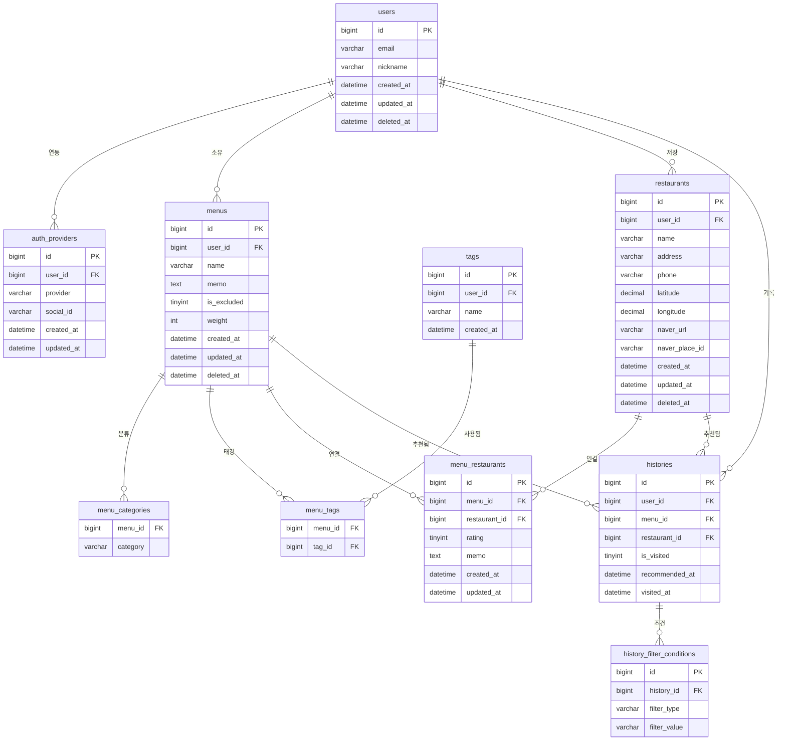

# 메뉴픽 맛집 추천 앱 — 백엔드 기술 설계 계획서

**2026-05-18**

---

## 목차

- [1. 기술 스택 및 아키텍처](#1-기술-스택-및-아키텍처)
    - [1.1 전체 스택 구성](#11-전체-스택-구성)
    - [1.2 서비스 아키텍처 구조](#12-서비스-아키텍처-구조)
- [2. API 설계 기준](#2-api-설계-기준)
    - [2.1 공통 규칙](#21-공통-규칙)
    - [2.2 공통 응답 포맷](#22-공통-응답-포맷)
    - [2.3 페이지네이션](#23-페이지네이션)
    - [2.4 HTTP 상태 코드 기준](#24-http-상태-코드-기준)
    - [2.5 주요 API 목록](#25-주요-api-목록)
- [3. 데이터 모델 (ERD 및 테이블 명세, 1NF 적용)](#3-데이터-모델-erd-및-테이블-명세-1nf-적용)
    - [3.0 1차 정규화(1NF) 적용 내역](#30-1차-정규화1nf-적용-내역)
    - [3.1 엔티티 관계 요약 (1NF 반영)](#31-엔티티-관계-요약-1nf-반영)
    - [3.2 테이블 명세 (1NF 적용)](#32-테이블-명세-1nf-적용)
- [3.3 2차 정규화(2NF) 적용 내역](#33-2차-정규화2nf-적용-내역)
    - [3.3.1 2NF 조건 및 분석 대상](#331-2nf-조건-및-분석-대상)
    - [3.3.2 menu_categories — 2NF 분석](#332-menu_categories--2nf-분석)
    - [3.3.3 menu_tags — 2NF 분석](#333-menu_tags--2nf-분석)
    - [3.3.4 tags — 후보키 기준 2NF 분석](#334-tags--후보키-기준-2nf-분석)
    - [3.3.5 2NF 전체 결론](#335-2nf-전체-결론)
    - [3.3.6 다음 단계: 3NF 검토 포인트 예고](#336-다음-단계-3nf-검토-포인트-예고)
- [3.4 3차 정규화(3NF) 적용 내역](#34-3차-정규화3nf-적용-내역)
    - [3.4.1 3NF 조건](#341-3nf-조건)
    - [3.4.2 전체 테이블 이행적 종속 검토](#342-전체-테이블-이행적-종속-검토)
    - [3.4.3 restaurants — 이행적 종속 상세 분석](#343-restaurants--이행적-종속-상세-분석)
    - [3.4.4 auth_providers — 이행적 종속 분석](#344-auth_providers--이행적-종속-분석)
    - [3.4.5 history_filter_conditions — 이행적 종속 분석](#345-history_filter_conditions--이행적-종속-분석)
    - [3.4.6 3NF 적용 후 최종 테이블 목록](#346-3nf-적용-후-최종-테이블-목록)
- [3.5 4차 · 5차 정규화(4NF · 5NF) 검토 및 적용 내역](#35-4차--5차-정규화4nf--5nf-검토-및-적용-내역)
    - [3.5.1 4NF 조건 및 다치 종속 개요](#351-4nf-조건-및-다치-종속-개요)
    - [3.5.2 전체 테이블 다치 종속(MVD) 검토](#352-전체-테이블-다치-종속mvd-검토)
    - [3.5.3 auth_providers — 다치 종속 상세 분석](#353-auth_providers--다치-종속-상세-분석)
    - [3.5.4 menu_restaurants — 다치 종속 상세 분석](#354-menu_restaurants--다치-종속-상세-분석)
    - [3.5.5 history_filter_conditions — 다치 종속 상세 분석](#355-history_filter_conditions--다치-종속-상세-분석)
    - [3.5.6 4NF 최종 결론](#356-4nf-최종-결론)
    - [3.5.7 5NF 조건 및 필요성 검토](#357-5nf-조건-및-필요성-검토)
    - [3.5.8 5NF 위반 발생 조건 판단](#358-5nf-위반-발생-조건-판단)
    - [3.5.9 5NF 최종 결론 및 적용 여부](#359-5nf-최종-결론-및-적용-여부)
    - [3.6 정규화 전체 요약 (1NF ~ 5NF)](#36-정규화-전체-요약-1nf--5nf)
- [3.7 DB 인덱스 설계](#37-db-인덱스-설계)
    - [3.7.1 인덱스 설계 원칙](#371-인덱스-설계-원칙)
    - [3.7.2 사용 인덱스 종류](#372-사용-인덱스-종류)
    - [3.7.3 테이블별 인덱스 상세 설계](#373-테이블별-인덱스-상세-설계)
    - [3.7.4 전체 인덱스 목록 요약](#374-전체-인덱스-목록-요약)
    - [3.7.5 주요 쿼리별 인덱스 활용 시나리오](#375-주요-쿼리별-인덱스-활용-시나리오)
    - [3.7.6 인덱스 성능 trade-off 및 모니터링](#376-인덱스-성능-tradeoff-및-모니터링)
- [4. 인증 설계 (JWT + OAuth2)](#4-인증-설계-jwt--oauth2)
    - [4.1 소셜 로그인 플로우](#41-소셜-로그인-플로우)
    - [4.2 JWT 토큰 정책](#42-jwt-토큰-정책)
    - [4.3 게스트 접근 정책](#43-게스트-접근-정책)
    - [4.4 회원 탈퇴 및 재가입 정책](#44-회원-탈퇴-및-재가입-정책)
- [5. 외부 지도 API 연동 (네이버 + 카카오)](#5-외부-지도-api-연동-네이버--카카오)
    - [5.1 연동 방식](#51-연동-방식)
    - [5.2 좌표 처리](#52-좌표-처리)
    - [5.3 거리 필터링 구현 전략](#53-거리-필터링-구현-전략)
- [6. 환경 분리 전략](#6-환경-분리-전략)
    - [6.1 환경 구성](#61-환경-구성)
    - [6.2 시크릿 관리 원칙](#62-시크릿-관리-원칙)
- [7. 비기능 요구사항](#7-비기능-요구사항)
    - [7.1 성능 목표](#71-성능-목표)
    - [7.2 보안 요구사항](#72-보안-요구사항)
    - [7.3 로깅 및 모니터링](#73-로깅-및-모니터링)
    - [7.4 시각 처리 정책](#74-시각-처리-정책)
    - [7.5 백업 및 복구 정책](#75-백업-및-복구-정책)
- [8. 리스크 및 대응 방안](#8-리스크-및-대응-방안)
- [9. 개발 우선순위 (백엔드 기준)](#9-개발-우선순위-백엔드-기준)

---

## 1. 기술 스택 및 아키텍처

### 1.1 전체 스택 구성

| 레이어 | 기술 | 버전 | 비고 |
| --- | --- | --- | --- |
| Language | Java | 17 LTS | Record, Sealed class 활용 |
| Framework | Spring Boot | 4.0.x | Spring Security, Web MVC |
| ORM | Spring Data JPA | 최신 | 파생 쿼리 + JPQL 사용 (Querydsl 미도입 — 현재 쿼리 복잡도에서 불필요) |
| Database | MySQL | 8.x | 공간 인덱스(Spatial Index)는 데이터 증가 시 도입 검토 |
| Migration | Flyway | 최신 | DB 스키마 버전 관리 |
| Auth | Spring Security + JWT | - | Access/Refresh Token 이중 구조 (token_type 클레임으로 구분) |
| Cache | Redis | 7.x | Refresh Token 저장, 외부 API 응답 캐싱, Rate Limit 카운터 |
| Build | Gradle | 9.x | - |
| Infra | Docker + Docker Compose | - | 로컬/스테이징 환경 |
| Logging | SLF4J + Logback | - | MDC 트레이싱 포함 |

### 1.2 서비스 아키텍처 구조

레이어드 아키텍처 (Controller → Service → Repository) 를 기본으로 하며, 외부 연동(네이버 API) 은 별도 Client 레이어로 분리한다.

| 레이어 | 패키지 | 책임 |
| --- | --- | --- |
| Presentation | controller/ | HTTP 요청/응답 처리, 입력 검증 (Bean Validation) |
| Application | service/ | 비즈니스 로직, 트랜잭션 관리 |
| Domain | domain/ | Entity, Repository 인터페이스, 도메인 이벤트 |
| Infrastructure | repository/, client/ | JPA 구현체, 네이버 API WebClient |
| Common | config/, security/, exception/ | 공통 설정, 인증 필터, 전역 예외 처리 |

## 2. API 설계 기준

### 2.1 공통 규칙

Base URL: /api/v1

Content-Type: application/json

인증: Authorization: Bearer {accessToken} 헤더

날짜/시간: ISO 8601 형식 (예: 2026-05-07T12:00:00Z)

문자 인코딩: UTF-8

### 2.2 공통 응답 포맷

모든 API 응답은 아래 구조를 따른다.

> ✅ 성공 응답 (2xx)

{ "success": true, "data": { ... }, "message": null }

> ⚠️ 실패 응답 (4xx / 5xx)

{ "success": false, "data": null, "message": "에러 설명", "code": "ERROR_CODE" }

### 2.3 페이지네이션

목록 조회 API는 커서 기반 페이지네이션을 기본으로 한다.

요청: GET /api/v1/menus?cursor=12345&size=20

응답 data 내: items[], nextCursor (null이면 마지막 페이지), hasNext

size 파라미터는 1~100으로 제한한다 (`@Min(1) @Max(100)`) — 과도한 페이지 크기 요청으로 인한 리소스 남용 방지

### 2.4 HTTP 상태 코드 기준

| 코드 | 의미 | 사용 시점 |
| --- | --- | --- |
| 200 OK | 성공 | 조회, 수정, 삭제 성공 |
| 201 Created | 생성 성공 | 메뉴/식당/태그 등 리소스 생성 |
| 400 Bad Request | 입력 오류 | 필수값 누락, 형식 불일치 |
| 401 Unauthorized | 인증 실패 | 토큰 없음 / 만료 |
| 403 Forbidden | 권한 없음 | (현재 미사용 — 아래 참고) |
| 404 Not Found | 리소스 없음 | 존재하지 않는 ID, **타인 소유 리소스 접근** |
| 409 Conflict | 중복 충돌 | 이미 존재하는 태그명 등 |
| 500 Internal Server Error | 서버 오류 | 예상치 못한 서버 오류 |
| 502 Bad Gateway | 외부 API 오류 | 네이버/카카오/소셜 제공자 장애 |
| 503 Service Unavailable | 일시적 불가 | Redis 장애 등 |

> **타인 소유 리소스는 403이 아니라 404로 응답한다.** 403을 주면 "그 ID는 존재한다"는 사실이
> 노출되어 ID를 훑는 것만으로 다른 사용자의 리소스 존재 여부를 확인할 수 있다. 조회 자체를
> `findByIdAndUserId...` 형태로 소유자 스코프에 가둬 존재 여부를 구분하지 않는다.

### 2.5 주요 API 목록

* 모든 엔드포인트는 /api/v1 prefix 생략 표기

#### 인증 (Auth)

| Method | Endpoint | 설명 | 인증 필요 |
| --- | --- | --- | --- |
| POST | /auth/kakao | 카카오 OAuth 로그인 / 회원가입 | N |
| POST | /auth/google | 구글 OAuth 로그인 / 회원가입 | N |
| POST | /auth/refresh | Access Token 재발급 (Refresh Token은 HttpOnly 쿠키로 전달) | N (쿠키) |
| DELETE | /auth/logout | 로그아웃 (Refresh Token 무효화) | Y |
| DELETE | /auth/withdraw | 회원 탈퇴 | Y |

#### 메뉴 (Menu)

| Method | Endpoint | 설명 | 인증 필요 |
| --- | --- | --- | --- |
| GET | /menus | 메뉴 목록 조회 (커서 페이지네이션) | Y |
| POST | /menus | 메뉴 생성 | Y |
| GET | /menus/{menuId} | 메뉴 상세 조회 | Y |
| PUT | /menus/{menuId} | 메뉴 수정 | Y |
| DELETE | /menus/{menuId} | 메뉴 삭제 (Soft delete) | Y |
| PATCH | /menus/weights | 선호 가중치 일괄 수정 | Y |
| GET | /menus/excluded | 추천 제외 메뉴 목록 조회 | Y |
| PATCH | /menus/{menuId}/exclude | 추천 제외 여부 토글 | Y |

#### 랜덤 픽 (Pick)

| Method | Endpoint | 설명 | 인증 필요 |
| --- | --- | --- | --- |
| POST | /pick | 필터(카테고리/태그/거리) 기반 가중치 랜덤 추천. 히스토리 자동 저장 후 historyId를 응답에 포함 | Y |

| GET | /pick/demo | 게스트 데모 픽. 고정 샘플에서 랜덤 반환, 저장 없음 (4.3) | N |

> ℹ️ 초기 설계의 `GET /menus/pick`은 필터 조건을 본문으로 받기 위해 `POST /pick`으로 변경됨. 게스트 데모도 같은 이유로 `/pick/demo`에 둔다 (4.3 참고).

#### 태그 (Tag)

| Method | Endpoint | 설명 | 인증 필요 |
| --- | --- | --- | --- |
| GET | /tags?keyword=혼밥 | 태그 자동완성 검색 | Y |
| POST | /tags | 새 태그 생성 | Y |
| DELETE | /tags/{tagId} | 태그 삭제 (연결 메뉴 연쇄 처리) | Y |

#### 식당 (Restaurant)

| Method | Endpoint | 설명 | 인증 필요 |
| --- | --- | --- | --- |
| GET | /restaurants | 저장한 식당 목록 조회 | Y |
| POST | /restaurants | 식당 저장 (좌표 포함) | Y |
| GET | /restaurants/{restaurantId} | 식당 상세 조회 | Y |
| PUT | /restaurants/{restaurantId} | 식당 정보 수정 | Y |
| DELETE | /restaurants/{restaurantId} | 식당 삭제 (Soft delete) | Y |

#### 외부 장소 검색 (Naver / Kakao 프록시)

| Method | Endpoint | 설명 | 인증 필요 |
| --- | --- | --- | --- |
| GET | /naver/geocode | 주소 → 좌표 변환 (네이버 Geocoding) | Y |
| GET | /naver/reverse-geocode | 좌표 → 주소 변환 (네이버 Reverse Geocoding) | Y |
| GET | /kakao/search/keyword | 키워드 장소 검색 (카카오 로컬) | Y |
| GET | /kakao/search/category | 카테고리 장소 검색 (카카오 로컬) | Y |

> ℹ️ 초기 설계의 `GET /restaurants/search`(네이버 Local Search 단일 프록시)는 네이버 Geocoding + 카카오 로컬 검색 조합으로 대체됨 (5장 참고). 응답은 Redis에 캐싱한다.

#### 메뉴-식당 연결 (MenuRestaurant)

| Method | Endpoint | 설명 | 인증 필요 |
| --- | --- | --- | --- |
| GET | /menus/{menuId}/restaurants | 메뉴에 연결된 식당 목록 조회 (삭제된 식당 제외) | Y |
| POST | /menus/{menuId}/restaurants | 메뉴에 식당 연결 + 별점/메모 저장 (중복 연결 시 409) | Y |
| PUT | /menus/{menuId}/restaurants/{restaurantId} | 별점/메모 수정 | Y |
| DELETE | /menus/{menuId}/restaurants/{restaurantId} | 연결 해제 | Y |

#### 히스토리 (History)

| Method | Endpoint | 설명 | 인증 필요 |
| --- | --- | --- | --- |
| GET | /history | 추천 히스토리 조회 (커서 페이지네이션, days 필터) | Y |
| PATCH | /history/{historyId}/visit | 방문 여부 업데이트 (바디 선택: restaurantId — 실제 방문 식당 기록) | Y |
| DELETE | /history/{historyId} | 히스토리 삭제 | Y |

> ℹ️ 초기 설계의 `POST /history`는 제거됨 — 히스토리는 `POST /pick` 처리 시 서버에서 자동 저장되며, 클라이언트는 응답의 historyId로 방문 처리 등 후속 작업을 수행한다.

## 3. 데이터 모델 (ERD 및 테이블 명세, 1NF 적용)

### 3.0 1차 정규화(1NF) 적용 내역

1NF 조건: ① 모든 컬럼이 원자값(Atomic Value)이어야 한다. ② 반복 그룹이 없어야 한다. ③ 각 행을 유일하게 식별하는 기본키가 존재해야 한다.

| 위반 테이블 | 위반 컬럼 | 위반 유형 | 조치 |
| --- | --- | --- | --- |
| menus | category (ENUM) | 다중값 가능성 — 기획서 '1개 이상' 명시 | menu_categories 분리 테이블로 이동 |
| users | provider (ENUM) | provider 종류 증가 시 스키마 변경 필요 (반복 그룹 잠재) | auth_providers 별도 테이블로 분리 |
| histories | filter_snapshot (JSON) | JSON은 내부에 반복 그룹 포함 — 원자값 위반 | history_filter_conditions 분리 테이블로 이동 |

*[ 그림 1 ] 메뉴픽 ERD — 정규화 완료 후 최종 10개 테이블*

### 3.1 엔티티 관계 요약 (1NF 반영)

| 관계 | 카디널리티 | 설명 |
| --- | --- | --- |
| User - Menu | 1 : N | 사용자는 여러 메뉴를 소유 |
| Menu - menu_categories | 1 : N | 메뉴는 카테고리를 1개 이상 가짐 (분리) |
| Menu - Tag | N : M | menu_tags 중간 테이블 |
| Menu - Restaurant | N : M | menu_restaurants 중간 테이블 (별점/메모 포함) |
| User - auth_providers | 1 : N | 소셜 로그인 provider 분리 (카카오/구글 등) |
| User - Restaurant | 1 : N | 사용자가 식당을 저장 |
| User - History | 1 : N | 사용자별 추천 히스토리 |
| History - Menu | N : 1 | 히스토리는 추천된 메뉴 참조 |
| History - Restaurant | N : 1 (nullable) | 히스토리는 추천된 식당 참조 (없을 수도 있음) |
| History - history_filter_conditions | 1 : N | 추천 시 적용 필터 조건 원자화 분리 |

### 3.2 테이블 명세 (1NF 적용)

#### users

> ⚠️ 1NF 조치: provider 컬럼 제거 → auth_providers 테이블로 분리

| 컬럼 | 타입 | NULL | 설명 |
| --- | --- | --- | --- |
| id | BIGINT (PK, AI) | N | 사용자 고유 ID |
| email | VARCHAR(255) | Y | 이메일 (소셜에서 제공 시) |
| nickname | VARCHAR(50) | N | 닉네임 |
| created_at | DATETIME | N | 생성 시각 |
| updated_at | DATETIME | N | 수정 시각 |
| deleted_at | DATETIME | Y | Soft delete 처리 시각 |

*기존 social_id, provider 컬럼 제거 → auth_providers로 이동*

#### auth_providers (신규 — 1NF 분리)

> ✅ users.provider ENUM 제거 후 신설. provider 종류 추가 시 스키마 변경 없이 행 추가로 대응 가능.

| 컬럼 | 타입 | NULL | 설명 |
| --- | --- | --- | --- |
| id | BIGINT (PK, AI) | N | 고유 ID |
| user_id | BIGINT (FK) | N | 연결 사용자 |
| provider | VARCHAR(20) | N | 소셜 제공자 (KAKAO, GOOGLE 등) |
| social_id | VARCHAR(100) | N | 소셜 provider 고유 ID |
| created_at | DATETIME | N | 최초 연동 시각 |
| updated_at | DATETIME | N | 수정 시각 |

*INDEX: UNIQUE(provider, social_id) — 소셜 로그인 중복 가입 방지*

*향후 Apple 로그인 등 신규 provider 추가 시 스키마 변경 없이 데이터 행 추가로 대응*

#### menus

> ⚠️ 1NF 조치: category ENUM 컬럼 제거 → menu_categories 테이블로 분리

| 컬럼 | 타입 | NULL | 설명 |
| --- | --- | --- | --- |
| id | BIGINT (PK, AI) | N | 메뉴 고유 ID |
| user_id | BIGINT (FK) | N | 소유 사용자 |
| name | VARCHAR(100) | N | 메뉴명 |
| memo | TEXT | Y | 개인 메모 |
| is_excluded | TINYINT(1) DEFAULT 0 | N | 추천 제외 여부 |
| weight | INT DEFAULT 1 | N | 선호 가중치 (1~5) |
| created_at | DATETIME | N | 생성 시각 |
| updated_at | DATETIME | N | 수정 시각 |
| deleted_at | DATETIME | Y | Soft delete |

*INDEX: (user_id)*

#### menu_categories (신규 — 1NF 분리)

> ✅ menus.category ENUM 제거 후 신설. 메뉴 1개에 카테고리 여러 개 지정 가능 (기획서 수용 기준 충족).

| 컬럼 | 타입 |
| --- | --- |
| menu_id | BIGINT (FK, PK) |
| category | VARCHAR(20) |

*PK: (menu_id, category) 복합 PK — 동일 메뉴에 같은 카테고리 중복 불가*

*INDEX: (category) — 카테고리 필터 조회 최적화*

#### tags

> ✅ 1NF 위반 없음. 변경 없이 유지.

| 컬럼 | 타입 | NULL | 설명 |
| --- | --- | --- | --- |
| id | BIGINT (PK, AI) | N | 태그 고유 ID |
| user_id | BIGINT (FK) | N | 태그 소유 사용자 |
| name | VARCHAR(50) | N | 태그명 (예: 혼밥가능) |
| created_at | DATETIME | N | 생성 시각 |

*INDEX: UNIQUE(user_id, name)*

#### menu_tags

> ✅ 1NF 위반 없음. 변경 없이 유지.

| 컬럼 | 타입 | NULL | 설명 |
| --- | --- | --- | --- |
| menu_id | BIGINT (FK, PK) | N | 메뉴 ID |
| tag_id | BIGINT (FK, PK) | N | 태그 ID |

*PK: (menu_id, tag_id) 복합 PK*

#### restaurants

> ✅ 1NF 위반 없음. 변경 없이 유지.

| 컬럼 | 타입 | NULL | 설명 |
| --- | --- | --- | --- |
| id | BIGINT (PK, AI) | N | 식당 고유 ID |
| user_id | BIGINT (FK) | N | 저장한 사용자 |
| name | VARCHAR(200) | N | 상호명 |
| address | VARCHAR(300) | Y | 도로명 주소 |
| phone | VARCHAR(20) | Y | 전화번호 |
| latitude | DECIMAL(10,7) | N | 위도 (WGS84) |
| longitude | DECIMAL(10,7) | N | 경도 (WGS84) |
| naver_url | VARCHAR(500) | Y | 네이버 지도 URL |
| naver_place_id | VARCHAR(100) | Y | 네이버 장소 ID |
| created_at | DATETIME | N | 생성 시각 |
| updated_at | DATETIME | N | 수정 시각 |
| deleted_at | DATETIME | Y | Soft delete |

*INDEX: (user_id), (latitude, longitude) — 거리 필터링용*

#### menu_restaurants

> ✅ 1NF 위반 없음. 변경 없이 유지.

| 컬럼 | 타입 | NULL | 설명 |
| --- | --- | --- | --- |
| id | BIGINT (PK, AI) | N | 고유 ID |
| menu_id | BIGINT (FK) | N | 연결 메뉴 |
| restaurant_id | BIGINT (FK) | N | 연결 식당 |
| rating | TINYINT | Y | 별점 (1~5) |
| memo | TEXT | Y | 개인 메모/팁 |
| created_at | DATETIME | N | 생성 시각 |
| updated_at | DATETIME | N | 수정 시각 |

*INDEX: UNIQUE(menu_id, restaurant_id)*

#### histories

> ⚠️ 1NF 조치: filter_snapshot JSON 컬럼 제거 → history_filter_conditions 테이블로 분리

| 컬럼 | 타입 | NULL | 설명 |
| --- | --- | --- | --- |
| id | BIGINT (PK, AI) | N | 히스토리 고유 ID |
| user_id | BIGINT (FK) | N | 사용자 |
| menu_id | BIGINT (FK) | Y | 추천된 메뉴 (삭제 시 NULL) |
| restaurant_id | BIGINT (FK) | Y | 추천된 식당 (없을 수도 있음) |
| is_visited | TINYINT(1) DEFAULT 0 | N | 방문 여부 |
| recommended_at | DATETIME | N | 추천 시각 |
| visited_at | DATETIME | Y | 방문 기록 시각 |

*INDEX: (user_id, recommended_at DESC)*

*기존 filter_snapshot JSON 컬럼 제거 → history_filter_conditions로 이동*

#### history_filter_conditions (신규 — 1NF 분리)

> ✅ histories.filter_snapshot JSON 제거 후 신설. 각 필터 조건을 원자값 행으로 저장.

| 컬럼 | 타입 | NULL | 설명 |
| --- | --- | --- | --- |
| id | BIGINT (PK, AI) | N | 고유 ID |
| history_id | BIGINT (FK) | N | 연결 히스토리 |
| filter_type | VARCHAR(20) | N | 필터 종류: CATEGORY / TAG_INCLUDE / TAG_EXCLUDE / MAX_DISTANCE |
| filter_value | VARCHAR(100) | N | 필터 값 (예: KOREAN, 혼밥가능, 500) |

*INDEX: (history_id)*

*예시 행: (1, 101, 'CATEGORY', 'JAPANESE'), (2, 101, 'TAG_INCLUDE', '혼밥가능'), (3, 101, 'MAX_DISTANCE', '500')*

## 3.3 2차 정규화(2NF) 적용 내역

### 3.3.1 2NF 조건 및 분석 대상

2NF 조건: 1NF를 만족하고, 기본키가 아닌 모든 컬럼이 기본키 전체에 완전 함수 종속되어야 한다. 즉 복합 기본키를 가진 테이블에서 일부 키에만 종속(부분 함수 종속)되는 컬럼이 없어야 한다.

> ℹ️ 2NF는 복합 PK 또는 복합 후보키를 가진 테이블에만 적용된다. 단일 PK 테이블은 이미 2NF를 자동 충족한다.

| 테이블 | PK 구조 | 비PK 컬럼 수 | 2NF 검토 결과 |
| --- | --- | --- | --- |
| users | 단일 PK (id) | 5 | 2NF 자동 충족 — 검토 불필요 |
| auth_providers | 단일 PK (id) | 5 | 2NF 자동 충족 — 검토 불필요 |
| menus | 단일 PK (id) | 8 | 2NF 자동 충족 — 검토 불필요 |
| menu_categories | 복합 PK (menu_id, category) | 0 | 비PK 컬럼 없음 → 위반 불가, 충족 |
| tags | 단일 PK (id) / 후보키: (user_id, name) | 2 | 후보키 기준 부분 종속 검토 필요 → 충족 |
| menu_tags | 복합 PK (menu_id, tag_id) | 0 | 비PK 컬럼 없음 → 위반 불가, 충족 |
| restaurants | 단일 PK (id) | 10 | 2NF 자동 충족 — 검토 불필요 |
| menu_restaurants | 단일 PK (id) | 5 | 2NF 자동 충족 — 검토 불필요 |
| histories | 단일 PK (id) | 6 | 2NF 자동 충족 — 검토 불필요 |
| history_filter_conditions | 단일 PK (id) | 3 | 2NF 자동 충족 — 검토 불필요 |

### 3.3.2 menu_categories — 2NF 분석

> ✅ 2NF 충족. 비PK 컬럼이 존재하지 않으므로 부분 함수 종속이 발생할 수 없다.

PK: (menu_id, category) — 이 두 컬럼 외 저장되는 데이터가 없으므로 2NF 위반 여지 자체가 없다.

### 3.3.3 menu_tags — 2NF 분석

> ✅ 2NF 충족. 비PK 컬럼이 존재하지 않으므로 부분 함수 종속이 발생할 수 없다.

PK: (menu_id, tag_id) — 연결 정보만 저장하는 순수 중간 테이블이다.

### 3.3.4 tags — 후보키 기준 2NF 분석

> ℹ️ 단일 PK(id) 외에 후보키 UNIQUE(user_id, name)도 존재한다. 후보키 기준 부분 함수 종속 여부를 검토한다.

tags 테이블 컬럼 구성:

| 컬럼 | 후보키(user_id, name)와의 관계 |
| --- | --- |
| id | 대리키 (Surrogate Key) — 후보키와 별개 |
| user_id | 후보키 구성 컬럼 |
| name | 후보키 구성 컬럼 |
| created_at | 후보키 전체(user_id + name)에 종속 — 태그를 등록한 시각은 user_id와 name 조합이 결정 |

> ✅ created_at은 후보키 (user_id, name) 전체에 완전 함수 종속된다. user_id만으로는 created_at을 결정할 수 없으므로 부분 함수 종속이 아니다. 2NF 충족.

### 3.3.5 2NF 전체 결론

> ✅ 현재 스키마는 1NF 적용 이후 모든 테이블이 2NF를 충족한다. 스키마 변경 없이 다음 단계(3NF)로 진행한다.

| 테이블 | 2NF 결과 | 근거 |
| --- | --- | --- |
| menu_categories | ✓ 충족 | 비PK 컬럼 없음 |
| menu_tags | ✓ 충족 | 비PK 컬럼 없음 |
| tags | ✓ 충족 | created_at은 후보키 전체에 완전 함수 종속 |
| 그 외 모든 테이블 | ✓ 충족 | 단일 PK — 2NF 자동 충족 |

### 3.3.6 다음 단계: 3NF 검토 포인트 예고

2NF 이후 확인할 이행적 함수 종속(Transitive Dependency) 후보는 다음과 같다.

| 테이블 | 검토 포인트 |
| --- | --- |
| restaurants | naver_place_id → naver_url 이행적 종속 가능성 |
| auth_providers | provider(소셜 로그인 유형) → 관련 정책 속성이 추가될 경우 별도 테이블 필요 |
| menu_restaurants | rating/memo가 menu_id 또는 restaurant_id에 단독 종속될 가능성 없음 — 충족 예상 |
| history_filter_conditions | filter_type → filter_value 유효 범위 등 메타 정보 이행 종속 가능성 |

## 3.4 3차 정규화(3NF) 적용 내역

### 3.4.1 3NF 조건

3NF 조건: 2NF를 만족하고, 기본키가 아닌 컬럼이 다른 비키 컬럼에 의존(이행적 함수 종속, Transitive Dependency)하지 않아야 한다.

이행적 함수 종속: A → B → C 관계에서 A → C가 성립할 때, C는 A에 직접 종속되지 않고 B를 경유하여 종속되는 상태.

### 3.4.2 전체 테이블 이행적 종속 검토

| 테이블 | 이행적 종속 후보 | 검토 결과 |
| --- | --- | --- |
| users | 없음 | ✓ 충족 |
| auth_providers | provider → (정책/메타) 가능성 | ✓ 충족 — 현재 정책 속성 없음 |
| menus | 없음 | ✓ 충족 |
| menu_categories | 없음 | ✓ 충족 |
| tags | 없음 | ✓ 충족 |
| menu_tags | 없음 | ✓ 충족 |
| restaurants | naver_place_id → naver_url 이행 종속 의심 | ⚠ 검토 필요 → 실용적 판단으로 유지 |
| menu_restaurants | 없음 | ✓ 충족 |
| histories | 없음 | ✓ 충족 |
| history_filter_conditions | filter_type → filter_value 유효 범위 가능성 | ✓ 충족 — 메타 정보 미저장 |

### 3.4.3 restaurants — 이행적 종속 상세 분석

> ⚠️ 이행적 종속 의심 대상: id → naver_place_id → naver_url

의심 근거:

| 종속 관계 | 설명 |
| --- | --- |
| id → naver_place_id | 식당 PK는 네이버 장소 ID를 결정한다 (직접 종속) |
| naver_place_id → naver_url | 네이버 장소 ID가 결정되면 해당 URL도 결정된다 (이행 종속 후보) |
| 결론: id → naver_url | naver_place_id를 경유하는 이행적 종속 의심 |

#### 분리 시 구조 (순수 3NF 적용 시)

> ℹ️ 이행 종속을 제거하면 naver_places 테이블을 별도 생성하고 restaurants에서 참조하는 구조가 된다.

| 테이블 | 컬럼 | 설명 |
| --- | --- | --- |
| naver_places (신규) | id (PK), naver_place_id (UNIQUE), naver_url | 네이버 장소 메타 정보 |
| restaurants (변경) | naver_place_id 제거, naver_places_id (FK) 추가 | naver_places 참조 |

#### 실용적 판단 — 분리 보류 결정

> ⚠️ 3NF 위반이 맞으나, 이 프로젝트에서는 분리하지 않는다. 근거는 아래와 같다.

| 판단 기준 | 내용 |
| --- | --- |
| 조회 빈도 | naver_url은 식당 정보와 항상 함께 조회됨. JOIN 비용이 실익보다 크다. |
| 중복 가능성 | naver_place_id와 naver_url은 1:1 관계이며, 시스템 내에서 중복 저장될 경우가 없다. |
| 업데이트 이상 가능성 | 네이버 URL은 외부 시스템에 의해 변경되는 데이터이므로, 오히려 식당 단위로 관리하는 것이 이상 처리에 더 유리하다. |
| 구현 복잡도 | naver_places 테이블 분리 시 식당 검색/저장 API 로직이 불필요하게 복잡해진다. |

*결론: restaurants 테이블에서 naver_place_id와 naver_url의 이행적 종속은 실용적 이유(조회 성능, 단순성)로 비정규화(Controlled Denormalization)를 허용한다. 단, 향후 네이버 장소를 별도로 공유/관리해야 하는 요구사항이 생기면 분리를 재검토한다.*

### 3.4.4 auth_providers — 이행적 종속 분석

> ✅ 3NF 충족. provider(소셜 플랫폼명) 컬럼이 있지만, provider를 통해 결정되는 정책/메타 속성(예: callback_url, scope 등)을 현재 테이블에 저장하지 않는다. 컬럼 추가 시 재검토 필요.

> ℹ️ 주의: 향후 provider별 scope, callback_url, 토큰 만료 정책 등을 auth_providers에 추가하면 id → provider → (정책 속성) 이행 종속이 발생한다. 이 경우 oauth_providers 마스터 테이블을 별도 생성해야 한다.

### 3.4.5 history_filter_conditions — 이행적 종속 분석

> ✅ 3NF 충족. filter_type이 filter_value의 유효 범위를 논리적으로 제약하지만, 이 메타 정보(유효 범위)를 현재 테이블에 컬럼으로 저장하지 않는다. 검증은 애플리케이션 레이어에서 처리.

### 3.4.6 3NF 적용 후 최종 테이블 목록

> ✅ restaurants의 비정규화 1건을 제외하고 모든 테이블이 3NF를 충족한다. 스키마 추가 변경 없음.

| 테이블명 | 1NF | 2NF | 3NF | 비고 |
| --- | --- | --- | --- | --- |
| users | ✓ | ✓ | ✓ | 1NF에서 auth_providers 분리 |
| auth_providers | ✓ | ✓ | ✓ | 1NF에서 신설 |
| menus | ✓ | ✓ | ✓ | 1NF에서 menu_categories 분리 |
| menu_categories | ✓ | ✓ | ✓ | 1NF에서 신설 |
| tags | ✓ | ✓ | ✓ | 변경 없음 |
| menu_tags | ✓ | ✓ | ✓ | 변경 없음 |
| restaurants | ✓ | ✓ | △ 의도적 비정규화 | naver_place_id→naver_url 이행 종속 허용 |
| menu_restaurants | ✓ | ✓ | ✓ | 변경 없음 |
| histories | ✓ | ✓ | ✓ | 1NF에서 history_filter_conditions 분리 |
| history_filter_conditions | ✓ | ✓ | ✓ | 1NF에서 신설 |

## 3.5 4차 · 5차 정규화(4NF · 5NF) 검토 및 적용 내역

### 3.5.1 4NF 조건 및 다치 종속 개요

4NF 조건: 3NF를 만족하고, 하나의 테이블에 두 개 이상의 독립적인 다치 종속(MVD, Multi-Valued Dependency)이 공존하지 않아야 한다.

다치 종속(MVD): 릴레이션 R(A, B, C)에서 A의 값이 결정될 때, B의 값이 C의 값과 무관하게 독립적으로 여러 값을 가질 수 있는 상태. 즉 A →→ B이고 A →→ C인 경우, B와 C가 독립적이면 4NF 위반.

> ℹ️ 4NF는 한 테이블이 두 가지 이상의 독립적인 1:N 관계를 동시에 표현할 때 발생한다. 중간 테이블(연결 테이블)이 아닌 단일 엔티티 테이블에서 주로 문제가 된다.

### 3.5.2 전체 테이블 다치 종속(MVD) 검토

| 테이블 | 다치 종속 후보 | 검토 결과 |
| --- | --- | --- |
| users | 없음 — 단일 엔티티 속성만 보유 | ✓ 4NF 충족 |
| auth_providers | user_id →→ provider 가능성 검토 필요 | ✓ 4NF 충족 (아래 상세 분석) |
| menus | 없음 — 단일 엔티티 속성만 보유 | ✓ 4NF 충족 |
| menu_categories | menu_id →→ category (단일 MVD만 존재) | ✓ 4NF 충족 |
| tags | 없음 | ✓ 4NF 충족 |
| menu_tags | menu_id →→ tag_id (단일 MVD만 존재) | ✓ 4NF 충족 |
| restaurants | 없음 — 단일 엔티티 속성만 보유 | ✓ 4NF 충족 |
| menu_restaurants | menu_id →→ restaurant_id 검토 필요 | ✓ 4NF 충족 (아래 상세 분석) |
| histories | 없음 — 단일 엔티티 속성만 보유 | ✓ 4NF 충족 |
| history_filter_conditions | history_id →→ filter_type, filter_value 검토 필요 | ✓ 4NF 충족 (아래 상세 분석) |

### 3.5.3 auth_providers — 다치 종속 상세 분석

> ℹ️ 의심: user_id →→ provider (한 사용자가 카카오/구글 둘 다 연동 가능)

4NF 위반이 되려면 한 테이블에 두 개의 독립적인 MVD가 공존해야 한다.

| 항목 | 내용 |
| --- | --- |
| 테이블 컬럼 | id, user_id, provider, social_id, created_at, updated_at |
| MVD 후보 | user_id →→ provider (사용자 한 명이 여러 소셜 로그인 연동 가능) |
| 두 번째 MVD? | 존재하지 않음. provider와 독립적으로 다중값을 가지는 다른 속성이 없다. |
| 결론 | 단일 MVD만 존재 → 4NF 위반 조건 미충족 → 충족 |

> ✅ auth_providers는 사용자 ↔ 소셜 로그인 연결이라는 단일 목적의 테이블이다. MVD가 하나만 존재하므로 4NF 충족.

### 3.5.4 menu_restaurants — 다치 종속 상세 분석

> ℹ️ 의심: menu_id와 restaurant_id 외에 rating, memo 속성이 있어 복합 다치 종속 가능성 검토

| 항목 | 내용 |
| --- | --- |
| 테이블 컬럼 | id, menu_id, restaurant_id, rating, memo, created_at, updated_at |
| 관계의 성격 | menu_id와 restaurant_id의 조합(쌍)에 rating/memo가 종속되는 구조 |
| MVD 존재 여부 | menu_id →→ restaurant_id 는 성립하지 않음. rating/memo는 (menu_id, restaurant_id) 쌍에 종속된 단일 값(함수 종속)이지 다치 종속이 아니다. |
| 결론 | 4NF 위반 없음 — rating/memo는 연결 쌍에 대한 일반 속성 |

> ✅ menu_restaurants의 rating과 memo는 (menu_id, restaurant_id) 조합 전체에 함수 종속된 단일 속성이다. 다치 종속이 아니므로 4NF 충족.

### 3.5.5 history_filter_conditions — 다치 종속 상세 분석

> ℹ️ 의심: history_id에 대해 filter_type과 filter_value가 독립적 다치 종속 가능성

| 항목 | 내용 |
| --- | --- |
| 테이블 컬럼 | id, history_id, filter_type, filter_value |
| MVD 후보 1 | history_id →→ filter_type (하나의 히스토리에 여러 필터 타입이 존재) |
| MVD 후보 2? | history_id →→ filter_value 는 독립적이지 않음. filter_value는 반드시 filter_type과 함께 의미를 가지며, 두 값은 항상 쌍(pair)으로 저장됨. |
| 독립성 판단 | filter_type과 filter_value는 독립적인 두 속성이 아니라 하나의 조건을 표현하는 쌍이다. 실제 행: (CATEGORY, KOREAN), (TAG_INCLUDE, 혼밥가능) — 분리 불가. |
| 결론 | 단일 MVD(history_id →→ (filter_type, filter_value) 쌍)만 존재 → 4NF 충족 |

> ✅ filter_type과 filter_value는 독립적 다치 속성이 아니라 하나의 조건 쌍이다. 두 개의 독립적 MVD가 공존하지 않으므로 4NF 충족.

### 3.5.6 4NF 최종 결론

> ✅ 전체 10개 테이블 모두 4NF를 충족한다. 스키마 변경 없음.

| 테이블명 | MVD 유형 | 4NF 결과 |
| --- | --- | --- |
| users | MVD 없음 | ✓ 충족 |
| auth_providers | 단일 MVD (user_id →→ provider) | ✓ 충족 — 독립 MVD 2개 미존재 |
| menus | MVD 없음 | ✓ 충족 |
| menu_categories | 단일 MVD (menu_id →→ category) | ✓ 충족 — 독립 MVD 2개 미존재 |
| tags | MVD 없음 | ✓ 충족 |
| menu_tags | 단일 MVD (menu_id →→ tag_id) | ✓ 충족 — 독립 MVD 2개 미존재 |
| restaurants | MVD 없음 | ✓ 충족 |
| menu_restaurants | 함수 종속 (MVD 아님) | ✓ 충족 |
| histories | MVD 없음 | ✓ 충족 |
| history_filter_conditions | 단일 MVD (history_id →→ 조건 쌍) | ✓ 충족 — 독립 MVD 2개 미존재 |

### 3.5.7 5NF 조건 및 필요성 검토

5NF(PJNF, Project-Join Normal Form) 조건: 4NF를 만족하고, 조인 종속(Join Dependency)이 오직 후보키에 의해서만 성립해야 한다. 즉 테이블을 세 개 이상으로 분해했다가 다시 JOIN했을 때 원래 테이블과 정확히 동일한 결과를 얻을 수 있는 분해가 존재하지 않아야 한다.

> ℹ️ 5NF 위반은 3개 이상의 엔티티가 서로 독립적으로 관계를 맺는 삼각 관계(Triangular Relationship) 구조에서 주로 발생한다. 예: 공급자(Supplier) ↔ 부품(Part) ↔ 프로젝트(Project)가 3방향으로 독립 조합 가능한 경우.

### 3.5.8 5NF 위반 발생 조건 판단

| 5NF 위반 발생 조건 | 메뉴픽 스키마 해당 여부 |
| --- | --- |
| 3개 이상의 엔티티가 독립적 조합으로 관계를 맺는 구조 | 해당 없음 |
| (A, B), (B, C), (A, C) 쌍이 각각 독립적으로 의미를 갖는 구조 | 해당 없음 |
| 분해된 테이블 3개를 JOIN해야만 원래 의미가 복원되는 구조 | 해당 없음 |

#### menu_restaurants 3자 관계 검토 (가장 유력한 5NF 위반 후보)

> ℹ️ menu_restaurants는 menus ↔ restaurants를 연결한다. 여기에 users까지 연관될 경우 3자 관계가 될 수 있어 검토한다.

| 항목 | 내용 |
| --- | --- |
| 관계 구조 | menu_restaurants: (menu_id, restaurant_id) — 2자 관계 |
| user 개입 여부 | menu와 restaurant는 모두 user_id에 귀속되지만, menu_restaurants 자체는 user를 직접 참조하지 않는다. user → menu → restaurant 의 계층 구조이지 삼각 독립 관계가 아니다. |
| 독립 조합 가능성 | (menu_id, restaurant_id) 쌍은 사용자가 명시적으로 연결한 의미 있는 조합이다. (menu, user), (restaurant, user) 쌍이 독립적으로 테이블에 존재하지 않으므로 5NF 위반 조건 미충족. |
| 결론 | 5NF 위반 없음 |

### 3.5.9 5NF 최종 결론 및 적용 여부

> ✅ 전체 스키마에서 5NF 위반 조건에 해당하는 삼각 독립 관계가 존재하지 않는다. 5NF 적용 불필요, 스키마 변경 없음.

| 판단 근거 | 설명 |
| --- | --- |
| 메뉴픽은 개인화 데이터 중심 앱 | 모든 데이터는 user_id를 루트로 하는 계층 구조. 독립적인 3자 관계가 발생할 도메인 구조 자체가 없다. |
| 연결 테이블은 모두 2자 관계 | menu_tags, menu_categories, menu_restaurants 모두 두 엔티티 간 연결. 삼각 조합 구조 없음. |
| 5NF는 매우 특수한 케이스 | 실무에서 5NF까지 적용하는 경우는 극히 드물다. 공급망, 부품 조달 등 복잡한 다자 관계 도메인에서만 실질적으로 의미가 있다. |

### 3.6 정규화 전체 요약 (1NF ~ 5NF)

| 단계 | 조건 요약 | 메뉴픽 스키마 결과 | 조치 내용 |
| --- | --- | --- | --- |
| 1NF | 원자값, 반복 그룹 없음, PK 존재 | 위반 3건 발견 | auth_providers, menu_categories, history_filter_conditions 신설 (총 +3 테이블) |
| 2NF | 비키 컬럼의 완전 함수 종속 | 전체 충족 | 스키마 변경 없음 |
| 3NF | 이행적 함수 종속 없음 | 충족 (비정규화 1건 허용) | restaurants의 naver_place_id→naver_url 이행 종속을 실용적 이유로 유지 |
| 4NF | 독립적 다치 종속 2개 이상 공존 없음 | 전체 충족 | 스키마 변경 없음 |
| 5NF | 조인 종속이 후보키에 의해서만 성립 | 해당 없음 — 적용 불필요 | 삼각 독립 관계 구조 자체가 도메인에 없음 |

*최종 테이블 수: 기존 7개 → 정규화 후 10개 (auth_providers, menu_categories, history_filter_conditions 추가)*

*의도적 비정규화: restaurants.naver_url (3NF 위반 허용, 성능·단순성 우선)*

## 3.7 DB 인덱스 설계

### 3.7.1 인덱스 설계 원칙

인덱스는 읽기 성능을 높이는 대신 쓰기(INSERT/UPDATE/DELETE) 성능과 디스크 사용량을 희생한다. 메뉴픽은 읽기 비율이 쓰기보다 압도적으로 높은 서비스(조회 중심)이므로 조회 최적화를 우선한다.

| 원칙 | 설명 |
| --- | --- |
| 선두 컬럼 = 가장 자주 사용되는 조건 | 복합 인덱스에서 WHERE 절에 가장 먼저 등장하는 컬럼을 첫 번째로 배치 |
| 카디널리티 높은 컬럼 우선 | 값의 종류가 많을수록 인덱스 효율 증가 (user_id > is_excluded 순서) |
| Soft delete 컬럼 복합 처리 | deleted_at IS NULL 조건이 항상 포함되므로 주요 인덱스에 함께 구성 |
| 커버링 인덱스 적극 활용 | 자주 조회되는 컬럼을 인덱스에 포함시켜 테이블 랜덤 I/O 제거 |
| UNIQUE 인덱스로 제약 + 성능 동시 확보 | 중복 방지가 필요한 컬럼은 UNIQUE INDEX로 선언 |
| 과도한 인덱스 지양 | 테이블당 최대 5~7개 권장, 불필요한 인덱스는 쓰기 성능만 저하 |

### 3.7.2 사용 인덱스 종류

| 표기 | 종류 | 설명 |
| --- | --- | --- |
| PK | Primary Key Index | 테이블 생성 시 자동 생성, BIGINT AI 컬럼 |
| UQ | Unique Index | 중복 불가 제약 + 조회 최적화 동시 적용 |
| IDX | 일반 복합/단일 인덱스 | 조회 빈도가 높은 컬럼 조합 |
| CVR | 커버링 인덱스 | SELECT 컬럼까지 인덱스에 포함해 테이블 접근 생략 |

### 3.7.3 테이블별 인덱스 상세 설계

#### users

| 인덱스명 | 종류 | 컬럼 | 목적 및 근거 |
| --- | --- | --- | --- |
| PRIMARY | PK | id | 자동 생성 |
| uq_users_email | UQ | email | 이메일 중복 가입 방지 및 이메일 기반 조회 |

*deleted_at 기반 Soft delete 조회 시: WHERE deleted_at IS NULL — 빈도 낮아 별도 인덱스 불필요*

#### auth_providers

| 인덱스명 | 종류 | 컬럼 | 목적 및 근거 |
| --- | --- | --- | --- |
| PRIMARY | PK | id | 자동 생성 |
| uq_auth_provider_social | UQ | (provider, social_id) | 소셜 로그인 중복 가입 방지 — 로그인 시 가장 먼저 조회되는 조합 |
| idx_auth_user_id | IDX | user_id | 특정 사용자의 연동 소셜 목록 조회 (마이페이지, 로그아웃 등) |

*복합 UQ (provider, social_id): provider를 선두 컬럼으로 배치 — 로그인 시 provider 조건이 항상 먼저 적용됨*

#### menus

| 인덱스명 | 종류 | 컬럼 | 목적 및 근거 |
| --- | --- | --- | --- |
| PRIMARY | PK | id | 자동 생성 |
| idx_menus_user_deleted | IDX | (user_id, deleted_at) | 사용자 메뉴 목록 조회 — user_id 선두, deleted_at IS NULL 조건 함께 처리 |
| idx_menus_user_excluded | CVR | (user_id, is_excluded, id, name) | 랜덤 픽 후보 쿼리 — 커버링: user_id + is_excluded=0 필터링 후 id/name 반환까지 테이블 접근 없음 |
| idx_menus_name_search | IDX | (user_id, name) | 메뉴명 키워드 검색 (LIKE '검색어%' 패턴 지원) |

> 🔶 주의: LIKE '%검색어%' 패턴(앞에 % 포함)은 인덱스를 사용하지 못한다. 검색 기능이 중요하다면 Full-Text Index 또는 별도 검색 엔진 도입을 고려할 것.

*idx_menus_user_deleted: 선두 컬럼 user_id(높은 카디널리티) → deleted_at(IS NULL 조건) 순서가 최적*

#### menu_categories

| 인덱스명 | 종류 | 컬럼 | 목적 및 근거 |
| --- | --- | --- | --- |
| PRIMARY (복합) | PK | (menu_id, category) | 복합 PK — 중복 방지 및 menu_id 기준 조회 최적화 |
| idx_menu_categories_cat | IDX | category | 카테고리 필터 조회 — WHERE category IN ('KOREAN', 'JAPANESE') 쿼리 최적화 |

*복합 PK (menu_id, category): menu_id 선두 → 특정 메뉴의 카테고리 목록 조회에 최적. category 단독 인덱스는 역방향 필터 지원*

#### tags

| 인덱스명 | 종류 | 컬럼 | 목적 및 근거 |
| --- | --- | --- | --- |
| PRIMARY | PK | id | 자동 생성 |
| uq_tags_user_name | UQ | (user_id, name) | 사용자별 태그 중복 방지 + 태그 자동완성 쿼리(LIKE 'name%') 최적화 |
| idx_tags_name_prefix | IDX | (user_id, name) | 태그 자동완성 — WHERE user_id=? AND name LIKE '혼%' 패턴에 최적화 (UQ와 동일 구조이므로 UQ가 커버) |

*uq_tags_user_name이 자동완성 인덱스 역할도 겸함 — 별도 IDX 불필요, UQ 하나로 중복 방지 + 검색 최적화 동시 달성*

#### menu_tags

| 인덱스명 | 종류 | 컬럼 | 목적 및 근거 |
| --- | --- | --- | --- |
| PRIMARY (복합) | PK | (menu_id, tag_id) | 복합 PK — 메뉴별 태그 목록 조회 최적화 |
| idx_menu_tags_tag_id | IDX | tag_id | 역방향 조회 — 특정 태그를 가진 메뉴 목록 조회 (태그 필터 기능) |

*idx_menu_tags_tag_id: 태그 포함/제외 필터 쿼리에서 tag_id 조건으로 menu_id를 역조회할 때 필수*

#### restaurants

| 인덱스명 | 종류 | 컬럼 | 목적 및 근거 |
| --- | --- | --- | --- |
| PRIMARY | PK | id | 자동 생성 |
| idx_restaurants_user_deleted | IDX | (user_id, deleted_at) | 사용자 식당 목록 조회 — Soft delete 처리 포함 |
| idx_restaurants_location | IDX | (user_id, latitude, longitude) | 거리 필터링 — 사용자 식당 범위에서 Haversine 계산 대상 후보 추출 |
| idx_restaurants_naver_place | IDX | naver_place_id | 네이버 장소 ID 중복 저장 방지 및 중복 검색 조회 |

> 🔶 거리 필터링 성능 주의: (latitude, longitude) 복합 인덱스는 사각형 범위(BETWEEN) 검색에는 효과적이지만, 정확한 반경 계산(Haversine/ST_Distance_Sphere)은 결국 후보군을 먼저 좁힌 뒤 애플리케이션에서 필터링하는 2단계 전략이 필요하다. 데이터 증가 시 MySQL Spatial Index(Point 타입 + ST_Distance_Sphere)로 마이그레이션 권장.

#### menu_restaurants

| 인덱스명 | 종류 | 컬럼 | 목적 및 근거 |
| --- | --- | --- | --- |
| PRIMARY | PK | id | 자동 생성 |
| uq_menu_restaurant | UQ | (menu_id, restaurant_id) | 메뉴-식당 중복 연결 방지 + 조회 최적화 |
| idx_mr_restaurant_id | IDX | restaurant_id | 역방향 조회 — 특정 식당에 연결된 메뉴 목록 조회 |

#### histories

| 인덱스명 | 종류 | 컬럼 | 목적 및 근거 |
| --- | --- | --- | --- |
| PRIMARY | PK | id | 자동 생성 |
| idx_histories_user_time | IDX | (user_id, recommended_at DESC) | 최근 히스토리 조회 — 가장 빈번한 쿼리 패턴: WHERE user_id=? ORDER BY recommended_at DESC LIMIT N |
| idx_histories_visited | IDX | (user_id, is_visited, recommended_at DESC) | 방문 여부 필터 조회 — 미방문 목록, 방문 완료 목록 분리 조회 시 활용 |

*idx_histories_user_time: DESC 정렬 인덱스 — MySQL 8.0 이상에서 내림차순 인덱스 직접 지원. 7일 제한 조건(recommended_at >= NOW() - INTERVAL 7 DAY)도 이 인덱스로 커버 가능*

#### history_filter_conditions

| 인덱스명 | 종류 | 컬럼 | 목적 및 근거 |
| --- | --- | --- | --- |
| PRIMARY | PK | id | 자동 생성 |
| idx_hfc_history_id | IDX | history_id | 특정 히스토리의 필터 조건 전체 조회 — JOIN 또는 서브쿼리 시 필수 |
| idx_hfc_type_value | IDX | (history_id, filter_type) | 필터 타입별 조회 — CATEGORY 조건만 꺼내거나, TAG_INCLUDE 조건만 꺼낼 때 최적화 |

### 3.7.4 전체 인덱스 목록 요약

> ℹ️ 아래 목록은 DDL 작성 및 Flyway 마이그레이션 스크립트 작성 시 기준 문서로 사용한다.

| 테이블 | 인덱스명 | 종류 | 컬럼 |
| --- | --- | --- | --- |
| users | PRIMARY | PK | id |
| users | uq_users_email | UQ | email |
| auth_providers | PRIMARY | PK | id |
| auth_providers | uq_auth_provider_social | UQ | (provider, social_id) |
| auth_providers | idx_auth_user_id | IDX | user_id |
| menus | PRIMARY | PK | id |
| menus | idx_menus_user_deleted | IDX | (user_id, deleted_at) |
| menus | idx_menus_user_excluded | CVR | (user_id, is_excluded, id, name) |
| menus | idx_menus_name_search | IDX | (user_id, name) |
| menu_categories | PRIMARY | PK(복합) | (menu_id, category) |
| menu_categories | idx_menu_categories_cat | IDX | category |
| tags | PRIMARY | PK | id |
| tags | uq_tags_user_name | UQ | (user_id, name) |
| menu_tags | PRIMARY | PK(복합) | (menu_id, tag_id) |
| menu_tags | idx_menu_tags_tag_id | IDX | tag_id |
| restaurants | PRIMARY | PK | id |
| restaurants | idx_restaurants_user_deleted | IDX | (user_id, deleted_at) |
| restaurants | idx_restaurants_location | IDX | (user_id, latitude, longitude) |
| restaurants | idx_restaurants_naver_place | IDX | naver_place_id |
| menu_restaurants | PRIMARY | PK | id |
| menu_restaurants | uq_menu_restaurant | UQ | (menu_id, restaurant_id) |
| menu_restaurants | idx_mr_restaurant_id | IDX | restaurant_id |
| histories | PRIMARY | PK | id |
| histories | idx_histories_user_time | IDX | (user_id, recommended_at DESC) |
| histories | idx_histories_visited | IDX | (user_id, is_visited, recommended_at DESC) |
| history_filter_conditions | PRIMARY | PK | id |
| history_filter_conditions | idx_hfc_history_id | IDX | history_id |
| history_filter_conditions | idx_hfc_type_value | IDX | (history_id, filter_type) |

*총 인덱스 수: PK 10개 + UQ 4개 + IDX 11개 + CVR 1개 = 26개*

> **V3 마이그레이션(`V3__performance_indexes.sql`)에서 위 목록을 아래와 같이 조정했다.**
>
> | 변경 | 인덱스 | 근거 |
> | --- | --- | --- |
> | 추가 | `users(deleted_at)` | 탈퇴 정리 배치의 users 풀스캔 제거 (대부분 NULL이라 인덱스가 매우 작다) |
> | 추가 | `histories(user_id, id DESC)` | 커서 페이지네이션이 `ORDER BY id DESC`라 기존 `(user_id, recommended_at)`으로는 정렬을 커버하지 못해 filesort가 발생했다 |
> | 삭제 | `idx_hfc_history_id` | `idx_hfc_type_value(history_id, filter_type)`의 좌측 접두사라 완전 중복 |
> | 삭제 | `idx_menus_name_search` | 대응하는 쿼리가 없다 (메뉴명 검색 기능 미구현) |
> | 재생성 | `idx_menus_user_excluded` → `(user_id, is_excluded, deleted_at)` | 실제 픽 후보 쿼리가 `deleted_at IS NULL`을 포함하는데 기존 커버링 구성에는 빠져 있었다 |

### 3.7.5 주요 쿼리별 인덱스 활용 시나리오

| 쿼리 시나리오 | 사용 인덱스 | 예상 실행 계획 |
| --- | --- | --- |
| 사용자 메뉴 목록 조회 (삭제 제외) | idx_menus_user_deleted | ref(user_id) + range(deleted_at IS NULL) |
| 랜덤 픽 후보 추출 (제외 메뉴 필터) | idx_menus_user_excluded (CVR) | ref(user_id, is_excluded=0) → 테이블 접근 없이 id/name 반환 |
| 메뉴명 자동완성 검색 | idx_menus_name_search | ref(user_id) + range(name LIKE '돈%') |
| 태그 자동완성 검색 | uq_tags_user_name | ref(user_id) + range(name LIKE '혼%') |
| 태그 포함 필터 (특정 태그 메뉴 조회) | idx_menu_tags_tag_id → PK(menus) | ref(tag_id) → JOIN menus PK |
| 거리 기반 식당 후보 추출 | idx_restaurants_location | ref(user_id) + range(lat BETWEEN, lng BETWEEN) → App 레벨 Haversine |
| 최근 히스토리 7일 조회 | idx_histories_user_time | ref(user_id) + range(recommended_at) + filesort 없이 ORDER BY 처리 |
| 카카오 로그인 (소셜 계정 조회) | uq_auth_provider_social | eq_ref(provider, social_id) → 단건 조회 |

### 3.7.6 인덱스 성능 trade-off 및 모니터링

| 구분 | 내용 |
| --- | --- |
| 쓰기 성능 영향 | 인덱스 1개당 INSERT/UPDATE 시 약 10~30% 추가 비용 발생. 현재 26개 인덱스는 읽기 중심 서비스 기준 적정 수준. |
| 인덱스 비대화 방지 | menus, restaurants 테이블은 Soft delete로 삭제 데이터가 누적됨. 6개월~1년 주기로 deleted 데이터 아카이빙 및 OPTIMIZE TABLE 권장. |
| 실행 계획 모니터링 | 배포 후 EXPLAIN / EXPLAIN ANALYZE 로 주요 API 쿼리 실행 계획 확인. type=ALL(풀스캔) 발생 시 즉시 인덱스 보완. |
| Slow Query 로그 활성화 | MySQL slow_query_log=ON, long_query_time=1(초) 설정으로 1초 이상 쿼리 자동 수집. |
| 향후 검토 인덱스 | menus.name Full-Text Index (검색 고도화 시), restaurants Spatial Index (거리 필터 대용량 시), histories 파티셔닝 (데이터 1년+ 누적 시) |

## 4. 인증 설계 (JWT + OAuth2)

### 4.1 소셜 로그인 플로우

프론트엔드에서 소셜 SDK를 통해 Authorization Code를 획득한 뒤 백엔드로 전달하는 방식(서버 사이드 교환)을 사용한다.

| 단계 | 주체 | 동작 |
| --- | --- | --- |
| 1 | 프론트 | 카카오/구글 SDK로 Authorization Code 획득 |
| 2 | 프론트 → 백엔드 | POST /api/v1/auth/kakao { code: '...' } |
| 3 | 백엔드 | 카카오/구글 Token API 호출 → 사용자 프로필 획득 |
| 4 | 백엔드 | social_id + provider 기준으로 신규 가입 or 기존 사용자 조회 |
| 5 | 백엔드 → 프론트 | Access Token은 응답 바디, Refresh Token은 HttpOnly 쿠키(Set-Cookie)로 전달 |
| 6 | 프론트 | Access Token은 메모리에만 보관 — Refresh Token은 쿠키라 JS에서 접근 불가 |

*동일 소셜 계정의 동시 최초 로그인 시 UNIQUE(provider, social_id) 제약 위반이 발생할 수 있다 — 위반 예외를 잡아 재조회로 흡수해 양쪽 요청 모두 정상 처리한다.*

**계정 통합 정책 (이메일 기준 자동 통합)**: 처음 보는 (provider, social_id)라도 같은 이메일로 가입된 유저가 이미 있으면 새 계정을 만들지 않고 해당 유저에 소셜 연동(auth_providers 행)만 추가한다. 같은 사람이 카카오·구글로 각각 로그인해도 계정이 하나로 유지되고, `uq_users_email` UNIQUE 제약과도 충돌하지 않는다. OAuth 프로필에 이메일이 없으면 통합 없이 새 계정을 생성한다.

### 4.2 JWT 토큰 정책

| 구분 | 만료 시간 | 저장 위치 | 용도 |
| --- | --- | --- | --- |
| Access Token | 30분 | 프론트 메모리 (변수) | API 요청 인증 (Authorization 헤더) |
| Refresh Token | 14일 | HttpOnly 쿠키(클라이언트) + Redis(서버, key: userId) | Access Token 재발급 |

**Refresh Token 전달 방식 (HttpOnly 쿠키)** — 클라이언트가 웹 기반으로 확정되어 XSS 탈취 방어를 우선해 쿠키 방식을 채택했다.

- 쿠키 속성: `HttpOnly` + `Secure`(로컬 http만 AUTH_COOKIE_SECURE=false로 완화) + `SameSite=Strict` + `Path=/api/v1/auth` (auth 외 엔드포인트로 쿠키가 전송되지 않음)
- `/auth/refresh`는 바디 대신 쿠키에서 토큰을 읽고, 로그아웃/탈퇴 시 쿠키를 즉시 만료시킨다
- CSRF는 disable 상태를 유지한다 — 쿠키로 인증되는 엔드포인트는 `/auth/refresh`뿐이고 `SameSite=Strict`가 교차 사이트 전송 자체를 차단하며, 나머지 API는 Authorization 헤더 인증이라 CSRF와 무관하다
- 제약: `SameSite=Strict`이므로 프론트와 API는 같은 사이트(동일 도메인 또는 서브도메인)로 배포해야 한다

두 토큰은 `token_type` 클레임("access" / "refresh")으로 구조적으로 구분한다

- 인증 필터는 `token_type=access`인 토큰만 허용 — Refresh Token을 Authorization 헤더에 넣어 일반 API에 접근하는 오용 차단
- `/auth/refresh`는 `token_type=refresh`인 토큰만 허용 — Access Token으로 재발급을 시도해 저장된 Refresh Token이 삭제(강제 로그아웃)되는 공격 차단

Refresh Token은 Redis에 userId를 키로 저장하여 강제 로그아웃(블랙리스트) 지원

토큰 재발급 시 Refresh Token도 함께 갱신 (Rotation 정책) — 저장된 값과 불일치하는 Refresh Token 제시 시 해당 유저의 Refresh Token을 즉시 폐기 (탈취 대응)

회원 탈퇴 시 Soft delete + Redis Refresh Token 즉시 삭제 (탈퇴/재가입 정책은 4.4 참고)

### 4.3 게스트 접근 정책

> ✅ **2026-08-12 구현 완료.** 경로는 설계안의 `GET /menus/pick/demo`가 아니라 **`GET /api/v1/pick/demo`**로 확정했다 — 픽 리소스가 이미 `POST /pick`으로 옮겨진 뒤라(2.5 참고) 데모만 `/menus` 아래 두면 같은 기능이 두 리소스로 갈린다. permitAll 규칙과 레이트 리밋을 엔드포인트와 같은 커밋에서 함께 추가했다.

게스트(미로그인) 사용자는 랜덤 픽 시연 기능에 한해 제한적으로 접근할 수 있다. 그 외 모든 기능은 로그인이 필요하다.

**데이터 출처**: 게스트에게는 등록된 메뉴가 없고 남의 데이터를 보여줄 수는 없으므로, 백엔드에 고정된 샘플 목록(`DemoPickService`)에서 균등 랜덤으로 고른다. **DB를 전혀 조회하지 않으며 히스토리도 남기지 않는다** — 히스토리는 사용자에 귀속되는 기록이라 주인이 없고, 인증 없이 열린 경로가 남용될 때 커넥션 풀을 소모하지 않는 이점도 있다. 응답에는 `id`·`historyId` 같은 식별자를 담지 않는다 (저장되지 않는 결과에 식별자를 붙이면 저장된 것처럼 오해를 준다).

가중치는 적용하지 않는다 — 사용자가 직접 설정하는 값이라 게스트에게는 의미가 없다.

그 외 API 인증 실패(401) 시 프론트는 로그인 화면으로 리다이렉트, 로그인 후 returnUrl로 복귀

시연 결과 화면에서 “저장하려면 로그인” CTA 버튼으로 전환 유도 (온보딩 퍼널 활용)

게스트 API는 Rate Limiting 적용 필수 (IP 기준, 분당 10회) — 샘플 데이터 남용 방지. `RateLimitFilter`에 `rl:demo:` 버킷으로 구현했다(`rate-limit.demo-limit-per-minute`, 기본 10). 미인증 경로라 사용자 ID로 묶을 수단이 없어 IP가 유일한 기준이다.

### 4.4 회원 탈퇴 및 재가입 정책

탈퇴는 30일 유예기간을 두는 Soft delete로 처리하고, 유예기간 경과 시 하드 삭제한다.

| 시점 | 처리 |
| --- | --- |
| 탈퇴 요청 | users.deleted_at 기록 (Soft delete) + Redis Refresh Token 즉시 삭제 |
| 유예기간(30일) 내 재로그인 | 계정 재활성화 (deleted_at 초기화, 최신 OAuth 프로필로 이메일/닉네임 갱신) |
| 유예기간 경과 후 재로그인 | 기존 데이터를 즉시 하드 삭제한 뒤 새 계정으로 가입 처리 |
| 매일 04:00 배치 | 유예기간이 지난 탈퇴 유저 일괄 하드 삭제 (유저별 트랜잭션 분리 — 개별 실패가 전체를 막지 않음) |

하드 삭제는 FK 참조 순서(자식 → 부모)대로 수행한다: 히스토리 필터 조건 → 히스토리 → 메뉴-식당 연결 → 메뉴 태그/카테고리 → 메뉴 → 태그 → 식당 → 소셜 연동(auth_providers) → 유저

유예기간 상수는 도메인(User.WITHDRAW_GRACE_PERIOD_DAYS)에서 단일 관리한다

> **매일 04:00 배치는 단일 인스턴스 배포를 전제로 한다.** 스케일 아웃 시 인스턴스마다 배치가 중복 실행될 수 있어 ShedLock 도입이 필요하다 (8장 리스크 표, [ImprovementBacklog.md 11번](ImprovementBacklog.md)).

## 5. 외부 지도 API 연동 (네이버 + 카카오)

### 5.1 연동 방식

프론트엔드가 외부 API를 직접 호출하지 않고, 백엔드가 프록시 역할을 수행한다. API 키가 클라이언트에 노출되지 않아 보안이 강화된다.

> ℹ️ 초기 설계는 네이버 Local Search 단일 연동이었으나, 장소 키워드/카테고리 검색은 카카오 로컬 API, 주소↔좌표 변환은 네이버 클라우드(NCP) Maps API 조합으로 변경됨.

| 항목 | 내용 |
| --- | --- |
| 사용 API | 네이버 NCP Maps — Geocoding / Reverse Geocoding, 카카오 로컬 — 키워드/카테고리 장소 검색 |
| 호출 주체 | Spring Boot 백엔드 (WebClient 사용) |
| 타임아웃 | connect 5초 / response 10초 — 외부 API 지연 시 요청 스레드 무한 대기 방지 |
| 예외 처리 | 실패 시 상태코드·응답 본문·원인 예외를 로깅한 뒤 502(BAD_GATEWAY) 계열 에러로 변환 |
| API 키 관리 | 환경 변수 (NAVER_MAPS_CLIENT_ID/SECRET, KAKAO_REST_API_KEY) — 코드에 하드코딩 금지 |
| 응답 저장 | 선택된 장소의 상호명, 주소, 좌표(WGS84)를 restaurants에 저장 |
| 쿼터 대응 | 응답을 Redis에 캐싱 (@Cacheable — naverGeocode, naverReverseGeocode 등) |

### 5.2 좌표 처리

네이버 NCP Geocoding과 카카오 로컬 API는 모두 WGS84 좌표를 직접 반환하므로 별도 좌표계 변환이 불필요하다 (초기 설계의 KATEC → WGS84 변환 로직 폐기)

저장된 latitude/longitude 컬럼 기준으로 Haversine 공식으로 거리 계산

### 5.3 거리 필터링 구현 전략

MySQL의 공간 함수(ST_Distance_Sphere) 활용 또는 애플리케이션 레벨 Haversine 계산 중 선택.

| 방법 | 장점 | 단점 | 권장 시점 |
| --- | --- | --- | --- |
| MySQL ST_Distance_Sphere | DB 레벨 처리, 인덱스 활용 가능 | MySQL 5.7.6+ 필요, 쿼리 복잡도 증가 | 데이터 수천 건 이상 |
| App 레벨 Haversine | 구현 단순, 테스트 용이 | 대량 데이터 시 성능 저하 | 초기 MVP 단계 |

*초기에는 App 레벨 Haversine으로 시작하고, 데이터 증가 시 ST_Distance_Sphere + Spatial Index로 마이그레이션한다.*

*거리 필터링과 추천 결과의 식당 목록 구성 시 Soft delete된 식당은 반드시 제외한다 (menu_restaurants 연결이 남아 있어도 삭제된 식당은 후보에서 배제).*

## 6. 환경 분리 전략

### 6.1 환경 구성

| 환경 | 목적 | 설정 파일 | DB | 상태 |
| --- | --- | --- | --- | --- |
| local | 개발자 로컬 | application-local.yml | Docker MySQL (로컬) | 구성 완료 |
| test | 자동화 테스트 | application-test.yml | H2 (in-memory, MySQL 모드) | 구성 완료 |
| dev | 팀 공유 개발 서버 | application-dev.yml | 개발 DB (`DB_URL` env) | 구성 완료 (스켈레톤, 실 호스트 값은 배포 시 주입) |
| staging | QA / 릴리즈 전 검증 | application-staging.yml | 스테이징 DB | 미구성 — 필요 시점에 추가 |
| prod | 운영 | application-prod.yml | 운영 DB (`DB_URL` env, 접근 최소화) | 구성 완료 (스켈레톤, 실 호스트 값은 배포 시 주입) |

활성 프로파일은 `SPRING_PROFILES_ACTIVE` 환경 변수로 지정한다 (미지정 시 local). 운영 배포 시 yml 수정 없이 환경 변수만으로 전환.

> **배포 대상(잠정)**: Oracle Cloud Free Tier — 아직 확정은 아니다([DecisionLog.md D-023](DecisionLog.md#d-023-배포-대상--oracle-cloud-free-tier-잠정)). PaaS가 아니라 VM을 직접 운영하는 방식이라, MySQL/Redis/앱을 한 대에 컨테이너로 함께 띄우는 `docker-compose.prod.yml`을 준비해뒀다. `.env.prod.example`을 복사해 실제 값을 채운 뒤 `docker compose -f docker-compose.prod.yml --env-file .env.prod up -d --build`로 기동한다. Free Tier의 Ampere A1(ARM) 인스턴스를 쓴다면 `eclipse-temurin`/`mysql`/`redis` 공식 이미지가 모두 arm64를 지원해 `Dockerfile` 수정 없이 그대로 빌드된다.

`local`/`test`는 `spring.datasource.url`을 yml에 고정해두고 계정 정보만 env로 받지만, `dev`/`prod`는 배포 대상마다 호스트가 달라지므로 `DB_URL` 전체를 env로 받는다(예: `jdbc:mysql://<host>:3306/menupick?...`). `dev`는 팀 협업용으로 `/swagger-ui`를 열어두고(`local`과 동일), `prod`는 `application.yml` 기본값(false)을 그대로 물려받아 닫혀 있다([DecisionLog.md D-021](DecisionLog.md#d-021-swagger-ui-노출--기본-off-local-프로파일만-on)).

### 6.2 시크릿 관리 원칙

application.yml에 실제 API 키, DB 비밀번호 등 민감 정보 하드코딩 금지

로컬: .env 파일 (Git 미포함, .gitignore 처리)

서버: OS 환경 변수 또는 Vault/Secret Manager 사용

Spring Boot에서 ${ENV_VAR_NAME} 방식으로 주입

필수 환경 변수 목록

| 변수명 | 설명 |
| --- | --- |
| SPRING_PROFILES_ACTIVE | 활성 프로파일 (미지정 시 local) |
| DB_USERNAME / DB_PASSWORD | DB 계정 정보 (local/test) |
| DB_URL | DB 전체 접속 URL — dev/prod 전용 (배포 대상마다 호스트가 다르므로 통째로 주입) |
| JWT_SECRET | JWT 서명 키 (256bit 이상 랜덤 문자열) — 기본값 없음, 미설정 시 앱 기동 실패 (fail-fast) |
| REDIS_HOST / REDIS_PORT | Redis 접속 정보 |
| NAVER_MAPS_CLIENT_ID / NAVER_MAPS_CLIENT_SECRET | 네이버 NCP Maps API 키 |
| KAKAO_REST_API_KEY | 카카오 로컬 API 키 |
| KAKAO_CLIENT_ID / KAKAO_CLIENT_SECRET / KAKAO_REDIRECT_URI | 카카오 OAuth 앱 키 |
| GOOGLE_CLIENT_ID / GOOGLE_CLIENT_SECRET / GOOGLE_REDIRECT_URI | 구글 OAuth 앱 키 |
| RATE_LIMIT_TRUST_PROXY | 리버스 프록시/LB 뒤 배포 시 true — X-Forwarded-For 기반 클라이언트 IP 식별 (기본 false) |
| AUTH_COOKIE_SECURE | Refresh Token 쿠키의 Secure 속성 (기본 true, 로컬 http 개발만 false) |
| FRONTEND_ORIGIN | CORS 허용 오리진 (dev/prod 전용, 쉼표로 복수 지정 가능) — local은 `http://localhost:5173` 고정값 사용 |

> ⚠️ JWT_SECRET은 로컬 개발용 기본값도 두지 않는다. 커밋된 기본 시크릿이 운영에 배포되는 사고를 원천 차단하기 위함이며, 로컬에서는 .env 또는 셸 환경 변수로 주입한다.

## 7. 비기능 요구사항

### 7.1 성능 목표

| 항목 | 목표값 | 비고 |
| --- | --- | --- |
| API 응답 시간 (P95) | < 300ms | 조회 API 기준 |
| 랜덤 픽 응답 시간 | < 500ms | 필터링 + 셔플 포함 |
| 네이버 API 프록시 응답 | < 1,000ms | 외부 API 포함 기준 |
| 동시 사용자 | 100명 (초기) | 트래픽 증가 시 스케일 업 검토 |
| DB 커넥션 풀 | HikariCP 기본 (10) | 초기 설정값 |

### 7.2 보안 요구사항

모든 API HTTPS 필수 (HTTP → HTTPS 리다이렉트)

SQL Injection 방지: JPA 파라미터 바인딩 준수, Querydsl 사용

XSS 방지: 응답 Content-Type 명시, 입력값 검증

CORS 정책: 허용 Origin 화이트리스트 관리 (운영 환경에서 * 금지)

Rate Limiting: 로그인/재발급 API 1분당 10회 제한 (Redis 카운터)

- INCR + EXPIRE를 Lua 스크립트로 원자 처리 — 중간에 프로세스가 죽어 TTL 없는 키가 남는 문제 방지
- Redis 장애 시 fail-open (요청 통과 + 경고 로그) — Rate Limit 인프라 장애가 로그인 전체 장애로 번지지 않도록
- 클라이언트 IP 식별: 기본은 직접 연결 IP, 프록시 뒤 배포 시에만 RATE_LIMIT_TRUST_PROXY=true로 X-Forwarded-For 첫 IP 사용 (직접 노출 환경에서 헤더 위조로 우회하는 것을 방지)

민감 정보 로그 출력 금지 (비밀번호, 토큰, 개인정보)

### 7.3 로깅 및 모니터링

MDC(Mapped Diagnostic Context)로 요청별 traceId 추가

로그 레벨: 운영 INFO, 개발 DEBUG

에러 발생 시 스택 트레이스 포함 ERROR 로그 출력

API 호출 로그: 요청 URI, Method, 응답 코드, 처리 시간 기록 (AOP 또는 Filter 활용)

Spring Actuator `health`/`metrics`/`prometheus` 엔드포인트 노출 (관리용 포트 분리 권장) + 장애 알림 채널(디스코드 웹훅 등) 최소 구성 — 상세는 [ImprovementBacklog.md 12번](ImprovementBacklog.md)

추후 APM (예: Sentry, Datadog) 연동 고려

### 7.4 시각 처리 정책

서비스 사용자층이 한국으로 고정되어 있어 **애플리케이션 시각은 KST(`Asia/Seoul`)로 고정**한다. `Clock` 빈을 주입해 사용하며, 코드에서 `LocalDateTime.now()`를 인자 없이 호출하지 않는다.

| 항목 | 정책 |
| --- | --- |
| 기준 시간대 | `Clock.system(ZoneId.of("Asia/Seoul"))` 빈 (`common/config/TimeConfig`) |
| 엔티티 | 엔티티 내부에서 현재 시각을 만들지 않는다 (빈 주입 불가) — 서비스가 시각을 인자로 넘긴다 |
| JPA Auditing | `DateTimeProvider`를 Clock 기반으로 등록해 `createdAt`/`updatedAt`도 동일 기준 |
| 스케줄러 | `@Scheduled(zone = "Asia/Seoul")` 명시 — 컨테이너가 UTC로 떠도 04:00 KST에 실행 |
| 테스트 | 시간 의존 테스트는 `Clock.fixed(...)`로 고정 (자정 경계 회귀 포함) |

> 컨테이너 기본 시간대는 보통 UTC다. Clock을 고정하지 않으면 `recommendedAt`이 9시간 어긋나 저장되고, 히스토리 `days` 필터 경계가 새벽 시간대에 하루씩 밀린다. 글로벌 확장 시점에는 저장을 `Instant`(UTC)로 바꾸고 표시 시점에 오프셋을 적용하는 방식으로 재검토한다.

### 7.5 백업 및 복구 정책

| 항목 | 정책 |
| --- | --- |
| 백업 주기 | 운영 전환 시 MySQL 일일 전체 백업(예: `mysqldump` 또는 관리형 DB의 자동 스냅샷) + Binlog 기반 PITR 활성화 |
| 보존 기간 | 최소 14일 (탈퇴 유저 하드삭제 배치가 30일 유예 후 실행되므로, 오삭제 인지까지 걸리는 기간을 고려해 최소 보존을 유예기간과 겹치지 않게 확보) |
| RPO (목표 복구 시점) | ≤ 24시간 (일일 백업 기준). Binlog PITR 적용 시 분 단위로 단축 가능 |
| RTO (목표 복구 시간) | ≤ 4시간 (개인 프로젝트 규모 기준 — SLA 계약 전까지는 목표치이지 보장치가 아님) |
| 오삭제 복구 절차 | 하드삭제 배치(`WithdrawnUserCleanupScheduler`)는 삭제 대상 `userId`를 로그로 남긴다 → 오삭제 신고 시 로그에서 대상 시각 확인 → 해당 시점 이전 백업에서 해당 유저 관련 행만 복원 (전체 복구는 다른 사용자 데이터를 되돌리는 부작용이 있어 지양) |

> 실제 운영 DB(관리형 서비스 또는 자체 호스팅)가 정해지기 전까지는 목표치이며, 배포 대상 확정 시(8번 CI/CD 항목과 연동) 실제 백업 도구와 스케줄을 확정해 이 표를 갱신한다.

## 8. 리스크 및 대응 방안

| 리스크 | 영향도 | 대응 방안 |
| --- | --- | --- |
| 네이버 API 쿼터 초과 (25,000/일) | 높음 | 검색 결과 Redis 캐싱 (TTL 1시간), 자주 검색되는 상호 우선 캐싱 |
| 위치 권한 거부 | 중간 | 위치 없이도 태그/카테고리 필터만으로 추천 동작, 거리 필터는 비활성화 안내 |
| 소셜 OAuth 정책 변경 | 중간 | Provider 추상화 인터페이스 설계로 대체 Provider 추가 용이하게 구성 |
| 초기 저장 데이터 부족으로 추천 품질 저하 | 중간 | 온보딩 단계에서 최소 3개 메뉴 입력 유도 UX + 샘플 데이터 제안 기능 |
| JWT 토큰 탈취 | 높음 | Access Token 만료 30분, Refresh Rotation, HTTPS 강제, HttpOnly Cookie |
| MySQL 거리 쿼리 성능 저하 | 낮음 (초기) | 초기 Haversine 앱 레벨 처리 → 데이터 증가 시 Spatial Index 마이그레이션 |
| Redis 장애 (단일 장애점) | 높음 | Rate Limit은 fail-open으로 흡수하지만, Refresh Token 저장소로서는 Redis 장애 시 로그인·재발급이 전면 불능. 현재 규모에서는 HA(Sentinel) 대신 "장애 시 전 사용자 재로그인 감수 + 신속 재기동"을 명시적으로 채택하고, AOF persistence를 켜 재기동 시 토큰 유실을 최소화한다. 트래픽 증가 시 Sentinel/Cluster 재검토 |
| 스케줄러 다중 인스턴스 중복 실행 | 낮음 (초기, 단일 인스턴스 전제) | `WithdrawnUserCleanupScheduler`는 단일 인스턴스 배포를 전제로 한다. 로직 자체는 유저별 트랜잭션 분리 + 하드삭제라 중복 실행되어도 두 번째 실행은 대상이 이미 없어 멱등에 가깝지만, 보장된 락은 아니다. 스케일 아웃 시점에 ShedLock(Redis 기반)을 도입해 인스턴스 간 배타 실행을 강제한다 — [ImprovementBacklog.md 11번](ImprovementBacklog.md) |

## 9. 개발 우선순위 (백엔드 기준)

| Phase | 작업 | 이유 | 상태 |
| --- | --- | --- | --- |
| Phase 1
(필수 기반) | DB 스키마 설계 및 Flyway 마이그레이션 설정 | 모든 기능의 기반 | ✅ 완료 |
| Phase 1 | JWT 인증 + 카카오/구글 OAuth 로그인 API | 인증 없이는 다른 API 테스트 불가 | ✅ 완료 |
| Phase 1 | 메뉴 CRUD API + 태그 자동완성 | 핵심 데이터 입력 경로 | ✅ 완료 |
| Phase 2
(핵심 기능) | 외부 지도 API 프록시(네이버/카카오) + 식당 저장 API | 지도 연동의 핵심 | ✅ 완료 |
| Phase 2 | 메뉴-식당 연결 API | 거리 필터·식당 추천의 전제 조건 | ✅ 완료 |
| Phase 2 | 필터링 + 가중치 랜덤 픽 API | 서비스의 메인 기능 | ✅ 완료 |
| Phase 2 | Haversine 거리 필터링 구현 | 위치 기반 추천의 핵심 | ✅ 완료 |
| Phase 3
(보완) | 히스토리 자동 저장 + 방문 여부 API | 회고 및 재방문 유도 | ✅ 완료 |
| Phase 3 | 선호 가중치 / 제외 목록 API | 추천 품질 개선 | ✅ 완료 |
| Phase 3 | Redis 캐싱 적용 (네이버/카카오 API) | 성능 최적화 | ✅ 완료 |
| Phase 3 | 탈퇴 유예기간·하드 삭제 배치, 토큰 타입 분리, Rate Limit 강화 | 보안·운영 안정성 | ✅ 완료 |
| Phase 4 | 게스트 데모 엔드포인트 (4.3) | 온보딩 퍼널 | ✅ 완료 |
| Phase 4 | dev/staging/prod 프로파일 구성 및 배포 | 운영 전환 | ⬜ 예정 |
| Phase 4 | 쿼리 레벨 필터링 전환 (Pick 인메모리 필터링 대체) | 메뉴 수 증가 시 성능 | ⬜ 데이터 증가 시 |
| Phase 4 | MDC traceId (7.3) | 관측성 | ✅ 완료 |
| Phase 4 | API 호출 로그, APM 연동 (7.3) | 관측성 | ⬜ 예정 |

본 문서는 개발 진행에 따라 지속 업데이트한다.

미해결 과제와 정책 결정 대기 항목은 [ImprovementBacklog.md](./ImprovementBacklog.md)에서 관리한다.

최종 수정: 2026-08-11